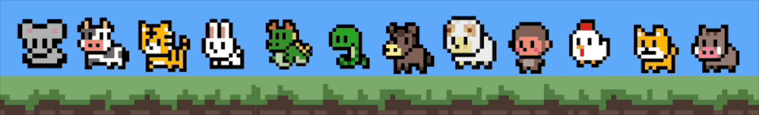
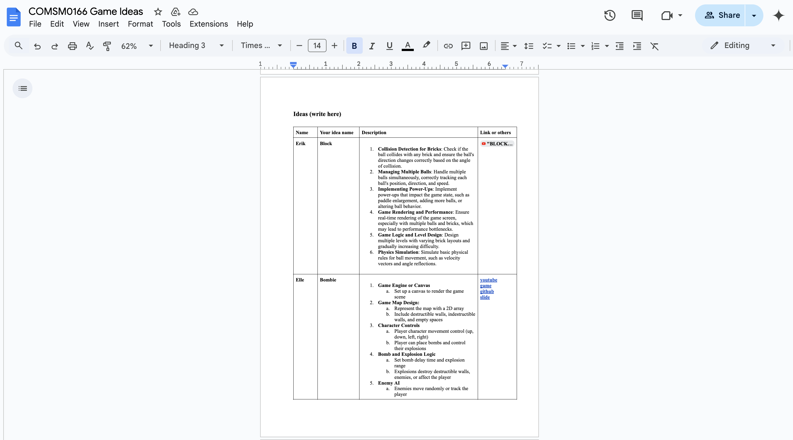
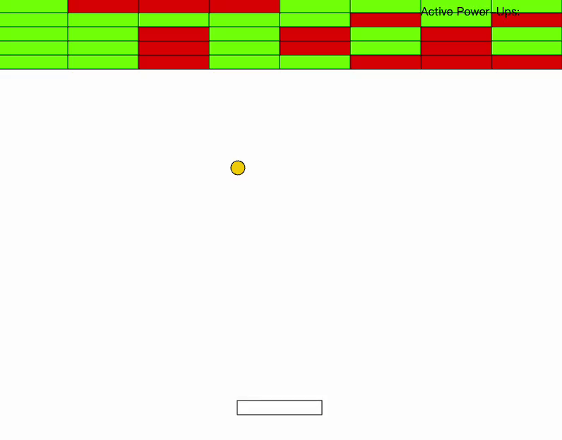
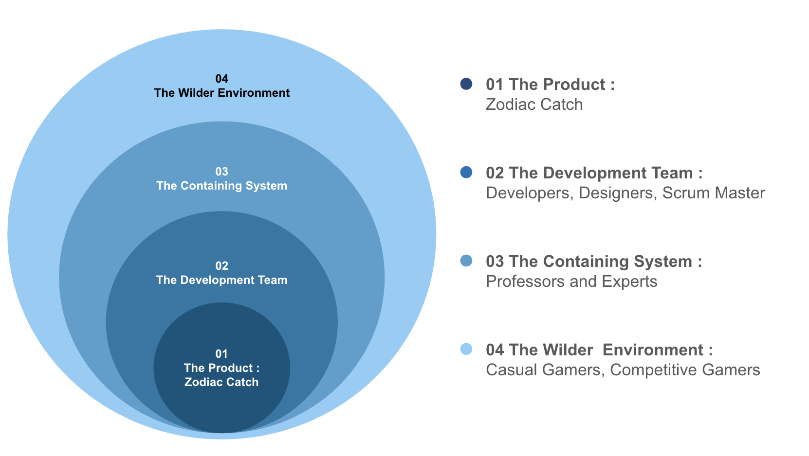
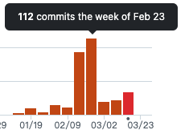

# 2025-group-19
2025 COMSM0166 group 19

# Our Game - ZODIAC CATCH

    

## Link

[PLAY HERE ▶️](https://uob-comsm0166.github.io/2025-group-19/)  
[Weekly Assignment 📚](https://github.com/UoB-COMSM0166/2025-group-19/blob/main/assignments/Readme.md)

# Table of Contents
- [Team Members](#team-members)
- [Introduction](#introduction)
- [Requirements](#requirements)
- [Design](#design)
- [Implementation](#implementation)
- [Evaluation](#evaluation)
- [Process](#process)
- [Sustainability, Ethics, and Accessibility](#sustainability-ethics-and-accessibility)
- [Conclusion](#conclusion)
- [References](#references)

---
# Team Members

| No.  | Name | Email | Role | 
| :-: | :-: | :-: | :-: |
| 01 | Hsin-Hsien Ho (Erik) | fp24955@bristol.ac.uk | `Developer` |
| 02 | Mingqiao Fan (Daisy) | yi24612@bristol.ac.uk | `Developer` |
| 03 | Shinchuan Chen (Lucas) | wj24296@bristol.ac.uk | `Developer` |
| 04 | Yu-Jin Chen (Elle) | nj24628@bristol.ac.uk | `Developer` |
| 05 | Lee Areta | wb24440@bristol.ac.uk | `Developer` |
| 06 |Mikas Vong | tg24484@bristol.ac.uk | `Developer` |

---
# Introduction

A fresh take on the beloved brick breaker, our game was inspired by and pays homage to the genre’s rich history that spans titles such as the original Breakout by Atari and Block.

  <b>Figure 1</b> 
  <i>Block</i> 
  

Like its predecessors, you use a paddle to control a limited amount of balls in order to destroy all playable blocks in a given level. Broken blocks have a chance of dropping power-ups that either aid or hinder your progress depending on the difficulty level. Bombs scattered throughout the levels also provide a means of removing rows more efficiently. 

As a unique twist, all levels in Zodiac Catch contain an unexpected element - blackholes. Unlike normal bricks, these are not only unbreakable, but cause any balls that hit them to be lost forever. The locations of these special bricks remain unknown until you encounter one. Thus, it is up to the player to tactically avoid them during their gameplay run.

To further put a spin on the typically non-narrative genre, our game is themed after the Chinese zodiac. Each stage corresponds to an animal from the twelve-year cycle: rat, ox, tiger, rabbit, dragon, snake, horse, goat, monkey, rooster, dog and pig. A bonus feature found on the main page, you can also enter your birth year to find the zodiac animal that represents you. 

  <b>Figure 2</b> 
  <i>12 zodiac animals</i> 
  

With fast-paced action and engaging mechanics, Zodiac Catch is a great way to put your video gaming skills to the test, and learn about Chinese mythology along the way.

---

# Requirements
In the early stages of the game project, we conducted a brainstorming session where team members came up with ideas based on their personal interests and the feasibility of the game. During the first meeting, we presented our proposals and voted on them. To facilitate creative brainstorming, we used Online Word as our discussion tool, enabling real-time sharing and collaboration.

<table>
    <tr>
        <th>Game Type</th>
        <th>Game Inspiration</th>
        <th>Game Description</th>
        <th>Possible Game Twists</th>
    </tr>
    <tr>
        <td><strong>Block</strong> 🟣</td>
        <td><a href="https://www.youtube.com/watch?v=aU1Hrpr2igM" target="_blank">Watch Gameplay</a></td>
        <td>
            A classic ball-and-brick game where players break bricks by bouncing a ball off a paddle.
        </td>
        <td>
            - Power-Ups: Special bricks drop power-ups like paddle enlargement or extra balls.  
            - Multi-Ball Chaos: Introduce multiple balls with different behaviors.
        </td>
    </tr>
    <tr>
        <td><strong>Bombie</strong> 💣</td>
        <td><a href="https://www.youtube.com/watch?v=W5vcOb7laG0" target="_blank">Watch Gameplay</a></td>
        <td>
            A bomb-based strategy game where players place bombs to destroy walls and eliminate opponents.
        </td>
        <td>
            - Smart AI Opponents: Enemies can strategically place bombs and evade explosions.  
            - Customizable Maps: Players can modify the layout and design of the battlefield.  
        </td>
    </tr>
    <tr>
        <td><strong>Temple Escape</strong> ⛩️</td>
        <td><a href="https://www.youtube.com/watch?v=eCpVc_ELSBk&list=PLEufPunsvT1cysv42S52Y6u59wxtlPb6j&index=1" target="_blank">Watch Gameplay</a></td>
        <td>
            A maze-based puzzle game where players move in straight lines until they hit a wall.
        </td>
        <td>
            - Traps & Timed Puzzles: Moving obstacles force players to think ahead.  
            - Power-ups & Outfits: Collectables provide unique perks.  
        </td>
    </tr>
    <tr>
        <td><strong>Ladder Master</strong> 🪜</td>
        <td><a href="https://www.youtube.com/watch?v=OkTk5ky-GWc" target="_blank">Watch Gameplay</a></td>
        <td>
            A challenging platformer where players must time movements carefully to cross obstacles.
        </td>
        <td>
            - 2D River Crossing: Instead of climbing, make it about crossing a river with unstable platforms.  
            - Character Color Change: Random color changes affect mechanics.
        </td>
    </tr>
    <tr>
        <td><strong>Level Devil</strong> 😈</td>
        <td><a href="https://www.youtube.com/watch?v=nn2EUssloa4" target="_blank">Watch Gameplay</a></td>
        <td>
            A tricky platformer filled with deceptive mechanics and unexpected traps.
        </td>
        <td>
            - Hidden Traps: Fake platforms and misleading paths test the player's observation skills.  
            - Dynamic Triggers: Actions change the level unpredictably.  
        </td>
    </tr>
</table>

  <b>Figure 3</b> 
  <i>Brainstormed Game Ideas on Online Word</i> 
  

## Early Stage Design
After brainstorming and discussions, we decided to use the brick breaker game as the project for this development. Next, we used a paper prototype to streamline the game flow, helping everyone gain a clearer blueprint and understanding of the game.

  <b>Figure 4</b> 
  <i>Paper Prototype</i> 
  

Following this, Eric began the initial development of the brick breaker game, which became the first prototype of our game.

 <b>Figure 5</b> 
 <i>Game prototype</i> 
 

When designing the levels, we referred to many templates, and some of the cartoon-style levels sparked new ideas. After some discussion, we decided to use animals as the visual theme for the levels and incorporated this concept into our digital prototype, further brainstorming and refining the game design from there. Ultimately, we chose the Chinese Zodiac as the core theme for the game, combining it with the brick-breaking gameplay, resulting in the creation of Zodiac Catch.

  <b>Figure 6</b> 
  <i>Digital prototype</i> 
  

## Identifying Stakeholders

  <b>Figure 7</b> 
  <i>Stakeholders</i> 
  

The stakeholders of Zodiac Catch are divided into four key groups:
At the core level, the product itself—Zodiac Catch—delivers a fun and challenging brick-breaker experience with Chinese zodiac elements.
The development team, consisting of developers, designers, and a Scrum Master, is responsible for building, testing, and refining the game to ensure its quality and playability.
In the containing system, professors and experts provide guidance, technical insights, and evaluation to support the game’s development.
Finally, in the wider environment, casual and competitive gamers engage with the game, offering valuable feedback that helps enhance its quality and overall experience.

<!-- ## User Case Diagram
(Add later) -->

<!-- ## Feasibility Studies
(Add later) -->

## User Stories & Epics
<table>
  <tr>
    <th>Epic</th>
    <th>Stakeholder</th>
    <th>User Story</th>
    <th>Requirement</th>
  </tr>
  <tr>
    <td rowspan="2">Creating an intriguing and various game experience</td>
    <td>User</td>
    <td>
      As a user, I want certain bricks to drop power-ups, such as paddle expansion, to add variety to the game.
    </td>
    <td>
      Given certain bricks contain a specific power-up, when the players break
      one of these bricks, then the corresponding power-up, such as double
      points or paddle expansion, will drop for the player to collect.
    </td>
  </tr>
  <tr>
    <td>Speedrun Competitor</td>
    <td>
      As a speedrun competitor, I want to have different records to pass the
      game.
    </td>
    <td>
      Given the game has time trials, when I play the game, then I can try to
      beat my previous records and climb the leaderboard.
    </td>
  </tr>
  <tr>
    <td rowspan="2">Try to learn from failure and frustrations</td>
    <td>Parents</td>
    <td>
      As parents, I want my children to train their focus and reaction speed.
    </td>
    <td>
      Given the increasing difficulty of levels, when the speed of the board
      increases, then the child needs to focus more and react fast to complete
      the level.
    </td>
  </tr>
  <tr>
    <td>Positive Reinforcer</td>
    <td>
      As a person who does better with positive encouragement, I want there to
      be a reward system, so that I’m more motivated to keep playing and
      complete harder levels.
    </td>
    <td>
      Given there is a completion ladder, when a certain level is
      completed/threshold is met, then rewards will be granted.
    </td>
  </tr>
  <tr>
    <td rowspan="2">Training Response Time</td>
    <td>User</td>
    <td>
      As a user, I want to improve my response time so that in the future, when
      something happens, especially in dangerous situations, I can react quickly
      and increase my chances of survival.
    </td>
    <td rowspan="2">
      Given that I want to train my response time, when the ball falls, I must
      catch it within a limited time in order to pass the stage.
    </td>
  </tr>
  <tr>
    <td>Gamer</td>
    <td>
      As a gamer, I want to train my response time so that in the future, when I
      participate in gaming competitions, I can react quickly to increase my
      chances of winning.
    </td>
  </tr>

  <tr>
    <td rowspan="2">Educational</td>
    <td>Parents</td>
    <td>
      As parents and teachers, I want my kids or students to learn Chinese
      culture through this game, so that they can explore different culture and
      immerse their experience.
    </td>
    <td>
      Given I want to teach kids the concept about Chinese zodiac, when kids
      enter the main page of the game, then they can know the number and the
      animal of Chinese zodiac.
    </td>
  </tr>
  <tr>
    <td>User</td>
    <td>
      As a user, I want to know my Chinese zodiac, so that in the future, I can
      know more about myself and go to fortune teller. When I go to Asian
      countries, I have more topic to have a conversation.
    </td>
    <td>
      Given I want to know my Chinese zodiac, when I enter the game select page
      and enter my birthday, then I can know about my Chinese zodiac.
    </td>
  </tr>
</table>

# Design
## Class Diagrams

After creating the paper prototype and sketching our ideas in wireframes, we moved on to designing our game's system architecture through in-person meetings. This process ensured a shared understanding of Object-Oriented Design and served as a reference for our source code.

In our initial meeting, we identified the game's essential components, such as the ball, paddle, and blocks. We then outlined the functions of each component, the unique features of different game stages, and how these elements interact. From this, we developed a basic class diagram.

  <b>Figure 8</b> 
  <i>Initial Class Diagram</i> 
  

During our first stage of coding, we decided to adopt the **Model-View-Controller (MVC)** design pattern, as it could accommodate our complex features and multiple game views. This led to a more detailed class diagram, which included:
- **Controllers** to handle keyboard input, manage game state across different stages, and activate special features.
- **Views** to define the game's aesthetics and user interface.
- **Models** to store all game components, including the brick patterns for various stages.
This structured approach helped us maintain a clear separation of concerns and facilitated scalable development.

  <b>Figure 9</b> 
  <i>Updated Class Diagram</i> 
  

## Sequence Diagram

  <b>Figure 10</b> 
  <i>Sequence Diagram</i> 
  

---
# Implementation
## Anticipated Challenges
Before the development stage, we anticipated several challenges:
* **Ball Physics**: We were uncertain whether implementing realistic ball behaviour upon collision, including angle and speed adjustments, would be difficult and require advanced physics knowledge.
* **Difficulty Balancing**: Various factors could influence the game's difficulty, such as ball speed, block patterns, black hole positioning, and the drop rate of power-ups. Managing these to create a balanced experience seemed challenging.
However, as we progressed, these concerns proved manageable. Since the ball moves without gravity, its position could be updated simply by adding or deducting to its x and y values. For difficulty balancing, we refined the parameters through iterative testing between our group members, and got positive feedback from the user evaluations. 

## Unexpected Challenges
While the above anticipated difficulties were easier to resolve, we faced unexpected challenges during development:
* **Ball Speed in Gravity Mode**  
    One of our power-ups introduces a gravity mode where all balls experience gravitational acceleration.  
    Our initial approach applied a downward acceleration similar to real-world physics. Since each frame represents a fraction of a second, ball speed was measured in pixels per frame. Gravity, as a form of acceleration, changes the ball's velocity, which we simulated by adjusting its vertical speed each frame.  
    However, implementing this became complex due to interactions with other power-ups that also influenced ball speed. During testing, it was difficult to isolate and evaluate the effects of gravity, especially with multiple balls on the screen.
* **Displaying Active Power-Ups and Timers**  
    Another challenge was accurately displaying the active power-ups and their countdowns on the sidebar. Ensuring the correct visuals and timings, particularly when multiple power-ups were active, required additional debugging and adjustments.  
    We achieved this by:  
    1. Making an instance of a timer after a player collects a power-up which keeps track of its duration 
    2. The power-up type and remaining time are sent to the sidebar for display to the player.
    3. In the case that the player collects the same type of power-up whilst the effect is still active, the `EffectController` will first reset the existing timer and then update the duration on the sidebar to reflect the newly collected power-up’s remaining time
    4. Once the timer for a power-up reaches zero, the effect will be removed from the sidebar, indicating the effect is no longer active

---
# Evaluation
It is very important to understand user’s reaction and their feedback. Since the project started, we have been carried out several evaluations to understand how well the game met players' expectations. At the same times, these feedback also help us to identify areas for improvement and assess.

The two major evaluation was held in the middle of the game, and the end of the project. These evaluation also segmented into two components: qualitative and quantitative.
## Qualitative Evaluation
Just after we finished the basic game prototype, we carried out first major evaluations, in the qualitative evaluation part, we asked each player to play our games several minutes and give us some feedback used Heuristic Evaluation to understand how players felt about the game.

### Player’s Feedback: 
In the later stages of development, our discussions and revisions were consistently guided by player feedback.

By understanding what players cared about during gameplay and collecting questionnaire responses, we summarised the following strengths and areas for improvement.

### What Players Enjoyed:

* **Art Design:** Users appreciated the pixel art style of the game, particularly the zodiac animal designs and the consistent pixel-style aesthetic, including the fonts and background.

* **Difficulty Balance:** Players noticed that in easy mode, they could become familiar with the gameplay mechanics and gain a sense of achievement after clearing a stage, while in hard mode, they could challenge themselves and become immersed in the variety of tools that added fun to the gameplay.

* **Variety of tools:** The variety and design of the tool were enjoyable, adding fun and excitement to the gameplay.

### What Players think it can be improved:

* **Lack of Instructions**: Several users found it unclear which keys or mouse actions were needed to progress through the game. Adding clearer instructions or a tutorial was suggested.

* **Paddle Visibility**: The low contrast between the paddle and the background made it difficult for players to locate the paddle, especially when first entering the game view. This caused confusion about what they could control.

* **Infinity Ball Indicator**: Players struggled to recognise when the Infinity Ball feature was active. Since this mechanic is crucial for progressing through stages, users suggested making its activation more visually apparent.

* **Power-Ups**: The power-ups dropping from bricks were too small for users to distinguish between different types. It was suggested that using distinct colours or shapes could improve clarity.

* **Ball-Paddle Collision Mechanics**: One user recommended that the ball should reflect at different angles depending on where it hits the paddle. This would provide players with greater control and add more variety to the gameplay.

* **Zodiac Year Explanation**: Users wanted more context on the Chinese Zodiac years and how they relate to birthdays. Adding a brief explanation in the stage selection view would help players understand why they should enter their birthdate.

  <b>Figure 11</b> 
  <i>Zodiac Catch</i> 
  

### Heuristic Evaluation: 
<table align="center">
  <tr>
    <th align="center">Interface Issue</th>
    <th align="center">Issues</th>
    <th align="center">Heuristic(s)</th>
    <th align="center">Frequency</th>
    <th align="center">Impact</th>
    <th align="center">Persistence</th>
    <th align="center">Severity</th>
  </tr>
  <tr>
    <td align="center">Stage Map</td>
    <td align="center">Confusing about how to pin in birthday and why?</td>
    <td align="center">Visibility of system status, User control and freedom</td>
    <td align="center">4</td>
    <td align="center">4</td>
    <td align="center">4</td>
    <td align="center">4</td>
  </tr>
  <tr>
    <td align="center">Game View</td>
    <td align="center">Celing and Sidewall is invisiable</td>
    <td align="center">User control and freedom</td>
    <td align="center">2</td>
    <td align="center">1</td>
    <td align="center">1</td>
    <td align="center">1.33</td>
  </tr>
  <tr>
    <td align="center">Game View</td>
    <td align="center">colour of the background and paddle clash</td>
    <td align="center">Visibility of system status</td>
    <td align="center">4</td>
    <td align="center">1</td>
    <td align="center">4</td>
    <td align="center">3</td>
  </tr>
  <tr>
    <td align="center">Game View</td>
    <td align="center">wish that there were more visual cues to notify that a power up has been eaten</td>
    <td align="center">Visibility of system status</td>
    <td align="center">4</td>
    <td align="center">1</td>
    <td align="center">1</td>
    <td align="center">2</td>
  </tr>
  <tr>
    <td align="center">Stage Selection</td>
    <td align="center">Unclear that user can enter their birth year, may be better to add a cursor
there</td>
    <td align="center">Visibility of system status</td>
    <td align="center">3</td>
    <td align="center">2</td>
    <td align="center">1</td>
    <td align="center">2</td>
  </tr>
</table>

The result of Heuristic Evaluation shows that nearly most of the sever problem are related to “Visibility of system status”, 

1. Players didn’t understand the relationship between the Chinese Zodiac and their birthday, which caused confusion about why they were asked to enter their birthdate. Based on this feedback, we plan to add an **explanation page** to clarify the reason behind this feature.
2. The background was described as overly flashy and visually distracting, making it difficult for players to distinguish between the paddle they were controlling and the background. Additionally, some players reported that the icons for effects were hard to recognize due to the lack of contrast.

## Quantitative Evaluation
In this part, we use NASA TLX and System Usability Scale to analyse how player feels about both easy mode and hard mode.

#### NASA TLX
We used the NASA Task Load Index (NASA-TLX) to evaluate the cognitive and physical workload imposed by both Easy and Hard game modes. The TLX assesses six dimensions: Mental Demand, Physical Demand, Temporal Demand, Performance, Effort, and Frustration.

#### Easy　Mode
<table align="center">
  <tr>
    <th align="center">User</th>
    <th align="center">Mental Demand</th>
    <th align="center">Physical Demand</th>
    <th align="center">Temporal Demand</th>
    <th align="center">Performance</th>
    <th align="center">Effort</th>
    <th align="center">Frustration</th>
    <th align="center">Score</th>
  </tr>
  <tr>
    <th align="center">User1</th>
    <td align="center">20</td>
    <td align="center">30</td>
    <td align="center">65</td>
    <td align="center">85</td>
    <td align="center">70</td>
    <td align="center">10</td>
    <td align="center">52.5</td>
  </tr>
  <tr>
    <th align="center">User2</th>
    <td align="center">20</td>
    <td align="center">15</td>
    <td align="center">35</td>
    <td align="center">45</td>
    <td align="center">45</td>
    <td align="center">25</td>
    <td align="center">33.0</td>
  </tr>
  <tr>
    <th align="center">User3</th>
    <td align="center">5</td>
    <td align="center">5</td>
    <td align="center">45</td>
    <td align="center">65</td>
    <td align="center">75</td>
    <td align="center">20</td>
    <td align="center">39.1</td>
  </tr>
  <tr>
    <th align="center">User4</th>
    <td align="center">55</td>
    <td align="center">75</td>
    <td align="center">75</td>
    <td align="center">45</td>
    <td align="center">60</td>
    <td align="center">50</td>
    <td align="center">70.0</td>
  </tr>
  <tr>
    <th align="center">User5</th>
    <td align="center">20</td>
    <td align="center">20</td>
    <td align="center">10</td>
    <td align="center">80</td>
    <td align="center">10</td>
    <td align="center">10</td>
    <td align="center">25.8</td>
  </tr>
  <tr>
    <th align="center">User6</th>
    <td align="center">45</td>
    <td align="center">45</td>
    <td align="center">30</td>
    <td align="center">80</td>
    <td align="center">25</td>
    <td align="center">10</td>
    <td align="center">43.4</td>
  </tr>
  <tr>
    <th align="center">User7</th>
    <td align="center">45</td>
    <td align="center">65</td>
    <td align="center">65</td>
    <td align="center">50</td>
    <td align="center">50</td>
    <td align="center">60</td>
    <td align="center">65.0</td>
  </tr>
  <tr>
    <th align="center">User8</th>
    <td align="center">20</td>
    <td align="center">20</td>
    <td align="center">50</td>
    <td align="center">75</td>
    <td align="center">20</td>
    <td align="center">50</td>
    <td align="center">44.2</td>
  </tr>
  <tr>
    <th align="center">User9</th>
    <td align="center">25</td>
    <td align="center">10</td>
    <td align="center">30</td>
    <td align="center">60</td>
    <td align="center">25</td>
    <td align="center">30</td>
    <td align="center">31.7</td>
  </tr>
  <tr>
    <th align="center">User10</th>
    <td align="center">60</td>
    <td align="center">60</td>
    <td align="center">70</td>
    <td align="center">60</td>
    <td align="center">65</td>
    <td align="center">50</td>
    <td align="center">70.8</td>
  </tr>
  <tr>
    <th align="center">User11</th>
    <td align="center">5</td>
    <td align="center">30</td>
    <td align="center">5</td>
    <td align="center">85</td>
    <td align="center">10</td>
    <td align="center">5</td>
    <td align="center">23.3</td>
  </tr>
  <tr>
    <th align="center">User12</th>
    <td align="center">60</td>
    <td align="center">60</td>
    <td align="center">65</td>
    <td align="center">70</td>
    <td align="center">75</td>
    <td align="center">45</td>
    <td align="center">72.5</td>
  </tr>
  <tr>
    <th align="center">User13</th>
    <td align="center">20</td>
    <td align="center">20</td>
    <td align="center">60</td>
    <td align="center">70</td>
    <td align="center">10</td>
    <td align="center">15</td>
    <td align="center">36.7</td>
  </tr>
  <tr>
    <th align="center">User14</th>
    <td align="center">65</td>
    <td align="center">80</td>
    <td align="center">65</td>
    <td align="center">70</td>
    <td align="center">70</td>
    <td align="center">30</td>
    <td align="center">75.0</td>
  </tr>
</table>

#### Hard Mode
<table align="center">
  <tr>
    <th align="center">User</th>
    <th align="center">Mental Demand</th>
    <th align="center">Physical Demand</th>
    <th align="center">Temporal Demand</th>
    <th align="center">Performance</th>
    <th align="center">Effort</th>
    <th align="center">Frustration</th>
    <th align="center">Score</th>
  </tr>
  <tr>
    <th align="center">User1</th>
    <td align="center">45</td>
    <td align="center">50</td>
    <td align="center">50</td>
    <td align="center">70</td>
    <td align="center">50</td>
    <td align="center">30</td>
    <td align="center">55.8</td>
  </tr>
  <tr>
    <th align="center">User2</th>
    <td align="center">20</td>
    <td align="center">30</td>
    <td align="center">60</td>
    <td align="center">85</td>
    <td align="center">70</td>
    <td align="center">25</td>
    <td align="center">55.0</td>
  </tr>
  <tr>
    <th align="center">User3</th>
    <td align="center">5</td>
    <td align="center">5</td>
    <td align="center">45</td>
    <td align="center">70</td>
    <td align="center">85</td>
    <td align="center">60</td>
    <td align="center">50.0</td>
  </tr>
  <tr>
    <th align="center">User4</th>
    <td align="center">55</td>
    <td align="center">70</td>
    <td align="center">70</td>
    <td align="center">75</td>
    <td align="center">65</td>
    <td align="center">50</td>
    <td align="center">75.8</td>
  </tr>
  <tr>
    <th align="center">User5</th>
    <td align="center">30</td>
    <td align="center">15</td>
    <td align="center">10</td>
    <td align="center">65</td>
    <td align="center">45</td>
    <td align="center">15</td>
    <td align="center">33.3</td>
  </tr>
  <tr>
    <th align="center">User6</th>
    <td align="center">50</td>
    <td align="center">55</td>
    <td align="center">55</td>
    <td align="center">70</td>
    <td align="center">45</td>
    <td align="center">25</td>
    <td align="center">56.7</td>
  </tr>
  <tr>
    <th align="center">User7</th>
    <td align="center">60</td>
    <td align="center">75</td>
    <td align="center">70</td>
    <td align="center">45</td>
    <td align="center">50</td>
    <td align="center">70</td>
    <td align="center">71.7</td>
  </tr>
  <tr>
    <th align="center">User8</th>
    <td align="center">75</td>
    <td align="center">30</td>
    <td align="center">65</td>
    <td align="center">70</td>
    <td align="center">55</td>
    <td align="center">45</td>
    <td align="center">65.8</td>
  </tr>
  <tr>
    <th align="center">User9</th>
    <td align="center">30</td>
    <td align="center">10</td>
    <td align="center">30</td>
    <td align="center">60</td>
    <td align="center">30</td>
    <td align="center">30</td>
    <td align="center">34.3</td>
  </tr>
  <tr>
    <th align="center">User10</th>
    <td align="center">70</td>
    <td align="center">70</td>
    <td align="center">75</td>
    <td align="center">50</td>
    <td align="center">70</td>
    <td align="center">70</td>
    <td align="center">80.0</td>
  </tr>
  <tr>
    <th align="center">User11</th>
    <td align="center">5</td>
    <td align="center">15</td>
    <td align="center">55</td>
    <td align="center">65</td>
    <td align="center">50</td>
    <td align="center">30</td>
    <td align="center">37.5</td>
  </tr>
  <tr>
    <th align="center">User12</th>
    <td align="center">50</td>
    <td align="center">50</td>
    <td align="center">50</td>
    <td align="center">55</td>
    <td align="center">50</td>
    <td align="center">60</td>
    <td align="center">60.0</td>
  </tr>
  <tr>
    <th align="center">User13</th>
    <td align="center">15</td>
    <td align="center">15</td>
    <td align="center">50</td>
    <td align="center">70</td>
    <td align="center">15</td>
    <td align="center">15</td>
    <td align="center">33.3</td>
  </tr>
  <tr>
    <th align="center">User14</th>
    <td align="center">70</td>
    <td align="center">80</td>
    <td align="center">80</td>
    <td align="center">50</td>
    <td align="center">75</td>
    <td align="center">30</td>
    <td align="center">71.2</td>
  </tr>
</table>

### Compare between easy and hard mode

<table align="center">
  <tr>
    <th align="center">Evaluation Aspect</th>
    <th align="center">Easy Avg. Score</th>
    <th align="center">Hard Avg. Score</th>
    <th align="center">Observation</th>
  </tr>
  <tr>
    <td align="center">Mental Demand</td>
    <td align="center">33.2</td>
    <td align="center">44.3</td>
    <td align="center">↑ Increased cognitive effort</td>
  </tr>
  <tr>
    <td align="center">Physical Demand</td>
    <td align="center">32.9</td>
    <td align="center">45.7</td>
    <td align="center">↑ Increased physical/operational strain</td>
  </tr>
  <tr>
    <td align="center">Temporal Demand</td>
    <td align="center">42.1</td>
    <td align="center">55.0</td>
    <td align="center">↑ Increased time pressure</td>
  </tr>
  <tr>
    <td align="center">Performance (higher = worse)</td>
    <td align="center">63.9</td>
    <td align="center">63.9</td>
    <td align="center">≈ Similar perceived performance</td>
  </tr>
  <tr>
    <td align="center">Effort</td>
    <td align="center">42.5</td>
    <td align="center">54.3</td>
    <td align="center">↑ More effort required</td>
  </tr>
  <tr>
    <td align="center">Frustration</td>
    <td align="center">27.9</td>
    <td align="center">39.6</td>
    <td align="center">↑ Higher frustration level</td>
  </tr>
</table>

Our analysis indicates that the Hard mode imposes a significantly greater workload than the Easy mode, particularly in terms of Mental Demand, Temporal Demand, and Frustration. While self-reported performance scores remained consistent across modes, players reported higher exertion and emotional tension when playing in Hard mode. These findings support the effectiveness of our difficulty design in increasing challenge, but also highlight the need for balancing difficulty with player satisfaction.

#### System Usability Scale

We conducted a System Usability Scale (SUS) evaluation across both Easy and Hard game modes to assess the overall usability and player perception. The scores were averaged per participant across both modes, and the results were rounded to the nearest integer for clarity. Each participant rated the system on 10 standardised SUS questions, leading to an aggregate score out of 100.

<table align="center">
  <tr>
    <th align="center">Participant</th>
    <th align="center">Like to Use Frequently</th>
    <th align="center">Unnecessarily Complex</th>
    <th align="center">Easy to Use</th>
    <th align="center">Need Technical Support</th>
    <th align="center">Functions Well Integrated</th>
    <th align="center">Too Much Inconsistency</th>
    <th align="center">Learn to Use Quickly</th>
    <th align="center">Cumbersome to Use</th>
    <th align="center">Confident to Use</th>
    <th align="center">Need to Learn a Lot</th>
    <th align="center">Total</th>
  </tr>
  <tr>
    <th align="center">1</th>
    <td align="center">5</td>
    <td align="center">1</td>
    <td align="center">5</td>
    <td align="center">1</td>
    <td align="center">5</td>
    <td align="center">1</td>
    <td align="center">5</td>
    <td align="center">1</td>
    <td align="center">4</td>
    <td align="center">1</td>
    <td align="center">29</td>
  </tr>
  <tr>
    <th align="center">2</th>
    <td align="center">3</td>
    <td align="center">1</td>
    <td align="center">5</td>
    <td align="center">2</td>
    <td align="center">5</td>
    <td align="center">2</td>
    <td align="center">5</td>
    <td align="center">2</td>
    <td align="center">4</td>
    <td align="center">1</td>
    <td align="center">27</td>
  </tr>
  <tr>
    <th align="center">3</th>
    <td align="center">4</td>
    <td align="center">1</td>
    <td align="center">4</td>
    <td align="center">2</td>
    <td align="center">4</td>
    <td align="center">1</td>
    <td align="center">5</td>
    <td align="center">1</td>
    <td align="center">4</td>
    <td align="center">3</td>
    <td align="center">29</td>
  </tr>
  <tr>
    <th align="center">4</th>
    <td align="center">5</td>
    <td align="center">2</td>
    <td align="center">3</td>
    <td align="center">2</td>
    <td align="center">5</td>
    <td align="center">1</td>
    <td align="center">3</td>
    <td align="center">1</td>
    <td align="center">5</td>
    <td align="center">2</td>
    <td align="center">29</td>
  </tr>
  <tr>
    <th align="center">5</th>
    <td align="center">3</td>
    <td align="center">4</td>
    <td align="center">3</td>
    <td align="center">4</td>
    <td align="center">4</td>
    <td align="center">3</td>
    <td align="center">4</td>
    <td align="center">3</td>
    <td align="center">3</td>
    <td align="center">4</td>
    <td align="center">34</td>
  </tr>
  <tr>
    <th align="center">6</th>
    <td align="center">5</td>
    <td align="center">3</td>
    <td align="center">5</td>
    <td align="center">2</td>
    <td align="center">4</td>
    <td align="center">2</td>
    <td align="center">5</td>
    <td align="center">2</td>
    <td align="center">4</td>
    <td align="center">2</td>
    <td align="center">31</td>
  </tr>
  <tr>
    <th align="center">7</th>
    <td align="center">2</td>
    <td align="center">1</td>
    <td align="center">5</td>
    <td align="center">1</td>
    <td align="center">5</td>
    <td align="center">1</td>
    <td align="center">5</td>
    <td align="center">1</td>
    <td align="center">5</td>
    <td align="center">1</td>
    <td align="center">27</td>
  </tr>
  <tr>
    <th align="center">8</th>
    <td align="center">3</td>
    <td align="center">4</td>
    <td align="center">2</td>
    <td align="center">4</td>
    <td align="center">4</td>
    <td align="center">3</td>
    <td align="center">4</td>
    <td align="center">3</td>
    <td align="center">3</td>
    <td align="center">4</td>
    <td align="center">33</td>
  </tr>
  <tr>
    <th align="center">9</th>
    <td align="center">5</td>
    <td align="center">2</td>
    <td align="center">5</td>
    <td align="center">3</td>
    <td align="center">4</td>
    <td align="center">2</td>
    <td align="center">5</td>
    <td align="center">2</td>
    <td align="center">5</td>
    <td align="center">2</td>
    <td align="center">34</td>
  </tr>
  <tr>
    <th align="center">10</th>
    <td align="center">4</td>
    <td align="center">3</td>
    <td align="center">5</td>
    <td align="center">4</td>
    <td align="center">4</td>
    <td align="center">3</td>
    <td align="center">5</td>
    <td align="center">3</td>
    <td align="center">4</td>
    <td align="center">2</td>
    <td align="center">35</td>
  </tr>
  <tr>
    <th align="center">11</th>
    <td align="center">4</td>
    <td align="center">3</td>
    <td align="center">4</td>
    <td align="center">2</td>
    <td align="center">4</td>
    <td align="center">2</td>
    <td align="center">5</td>
    <td align="center">2</td>
    <td align="center">4</td>
    <td align="center">2</td>
    <td align="center">30</td>
  </tr>
  <tr>
    <th align="center">12</th>
    <td align="center">4</td>
    <td align="center">2</td>
    <td align="center">3</td>
    <td align="center">4</td>
    <td align="center">4</td>
    <td align="center">2</td>
    <td align="center">3</td>
    <td align="center">2</td>
    <td align="center">3</td>
    <td align="center">4</td>
    <td align="center">31</td>
  </tr>
  <tr>
    <th align="center">13</th>
    <td align="center">5</td>
    <td align="center">2</td>
    <td align="center">5</td>
    <td align="center">4</td>
    <td align="center">5</td>
    <td align="center">1</td>
    <td align="center">5</td>
    <td align="center">2</td>
    <td align="center">4</td>
    <td align="center">3</td>
    <td align="center">36</td>
  </tr>
  <tr>
    <th align="center">14</th>
    <td align="center">5</td>
    <td align="center">1</td>
    <td align="center">4</td>
    <td align="center">3</td>
    <td align="center">5</td>
    <td align="center">1</td>
    <td align="center">4</td>
    <td align="center">1</td>
    <td align="center">5</td>
    <td align="center">3</td>
    <td align="center">31</td>
  </tr>
</table>

The SUS evaluation shows that the game is generally perceived as usable and user-friendly, with particularly strong ratings for ease of use, learning speed, and system integration. The consistency of responses between Easy and Hard modes suggests that the core interface is well-designed and scales effectively with difficulty. Some improvements may be explored to further reduce perceived complexity or technical support needs in the harder levels, but overall usability remains strong.

### Finding
Based on the Wilcoxon Signed-Rank Test:

-  By using the Wilcoxon Signed Rank Test, we obtained a score of 10 for the System Usability Survey (SUS) and a score of 17 for NASA TLX from surveys collected from 14 users. The alpha value is set to 0.05.

-  The NASA-TLX score is statistically significant, indicating that there may be a significant difference in the perception of workload between the easy and hard levels. From the user data, it can be observed that temporal demand and physical demand are usually high when users are playing the hard level. High temporal demand suggests that users may feel pressed for time while using the system, possibly indicating that tasks are too fast-paced. High physical demand indicates that users need to pay significant effort to interact with the system, which may be due to complex controls, excessive manual input, or inefficient workflows.
  
-  The SUS score is not statistically significant, suggesting that there is no significant difference in usability between the easy and hard levels. This implies that the system’s usability is perceived similarly across different difficulty levels. The average SUS score is 74.46 among the 14 surveys, which is above the average of 68. A score of 74.46 can be seen as a good indicator that users did not struggle significantly with using the system. While 74.46 is above average, excellent usability scores are above 80 so this suggests there is still room for improvement in certain areas to make the system even more intuitive and user-friendly.

-  Improvements based on NASA TLX: Simplify processes or enhance feedback mechanisms.
   
-  Improvements based on SUS:  Reduce temporal demand by allowing more flexible pacing or simplifying steps. Reduce physical demand by optimizing input methods and minimizing unnecessary actions.

## Final Evaluation

### Improvement

### New SUS

### Compare

---
# Process
## Collaboration
Our team adopted an Agile development process, incorporating Scrum and Extreme Programming (XP) principles to ensure efficiency, adaptability, and high-quality code.

### Agile Development
#### Scrum & Iterative Development
In the first eight weeks, Erik hosted our Scrum meetings, ensuring a structured workflow. Later, he proposed rotating the hosting role among all team members to foster leadership and shared responsibility. This allowed everyone to gain experience in facilitating discussions, reviewing code, and adapting to different coding styles, ultimately strengthening both individual and team skills.

We conducted Scrum meetings twice a week:
- Tuesdays: A comprehensive Kanban board review, where we created new tasks, reviewed outstanding ones, and planned weekly improvements.
- Thursdays: A stand-up meeting focused on addressing development challenges and ensuring smooth progress.

With the new rotation system, the weekly host also served as the designated code reviewer for that sprint. While all members could review code, the final approval and merge required confirmation from the assigned reviewer. Previously, only a few members handled code reviews, leading to an uneven workload. By distributing these responsibilities, we improved collaboration, knowledge sharing, and overall development efficiency.

#### Task Management & Workflow Refinement
Initially, we lacked a clear workflow, but through continuous adjustments, we developed an effective process. The Scrum rotation and structured code reviews improved collaboration and ensured long-term sustainability. To maintain steady progress and avoid last-minute rushes, we set one-week deadlines for each task, aligning with the XP Sustainable Pace principle. This structured approach kept each sprint well-paced and balanced.

### Version Control & Code Reviews
We adopted a structured Git branching model:

- Main branches: `main` (stable version) and `develop` (staging environment).
- Feature branches: Named using `feature/new_feature`, ensuring clarity and consistency.

Code reviews were mandatory before merging into the develop branch, promoting quality control and knowledge sharing. This process ensured collective ownership, where all team members were responsible for the entire codebase.

### Extreme Programming (XP) Practices
#### Simple Design
We adopted the Model-View-Controller (MVC) architecture to ensure a clear separation of concerns, making the system more modular and easier to maintain. Each component was organized based on its functionality, allowing for better code reusability and reducing complexity. This structured approach not only streamlined development but also facilitated collaboration among team members.

[Reference: MVC Architecture](https://github.com/UoB-COMSM0166/2025-group-19/tree/main/docs)

#### Sustainable Pace
To prevent last-minute rushes, we assigned a one-week deadline to each task, ensuring a steady workflow and avoiding `heroic efforts` before submission. This practice aligned with Extreme Programming’s (XP) Sustainable Pace principle, allowing us to maintain a consistent and manageable workload.

#### Coding Standards
We adhered to a consistent development standard, encompassing maintainability, readability, the MVC architecture, and object-oriented principles. After completing the implementation of a feature, we submitted a pull request for peer review by other team members.

#### Collective Ownership
All team members had ownership of the entire codebase, enabling anyone to modify any part when needed. This reduced bottlenecks and improved code quality. When challenges arose, such as issues with the black hole effect, ball physics, or sidebar power-ups, we collaborated to troubleshoot and refine solutions, enhancing the overall implementation.

#### Whole Team Approach
Everyone actively participated in all stages of the project, from planning to implementation, fostering cross-functional collaboration and improving overall development efficiency. During `Reading Week`, we focused on making significant progress, reducing stress from other deadlines. This effort led to our most productive week, delivering 112 commits, demonstrating our commitment to high-quality development.

As shown in the chart below, our team delivered 112 commits in the week of February 23—our most productive period. This effort demonstrated our commitment to working efficiently as a team, ensuring high development quality while minimizing last-minute pressure.

  <b>Figure 12</b> 
  <i>Productive Period</i> 
  

## Project Management Tools
Throughout the development process, we utilized ZenHub Kanban and Whimsical Wireframe to enhance project management and collaboration efficiency. These tools helped us track development progress, plan system architecture, and ensure seamless communication among team members.

### Zenhub Kanban
ZenHub’s seamless GitHub integration allowed us to manage tasks without switching platforms. It also supported Epics for organizing related issues, making it ideal for tracking larger tasks. The real-time sync between ZenHub and GitHub ensured data consistency, enhancing team efficiency.

  <b>Figure 13</b> 
  <i>Zenhub integrate Github</i> 
  

### Whimsical Wireframe

We use Whimsical to store and organize our `brainstorming drafts`, `level wireframes`, `mind maps`, and other project ideas. It provides real-time collaboration, allowing our team to work together seamlessly, co-edit documents, and share feedback instantly. Additionally, the sticky note feature enables quick discussions and idea exchanges, fostering smooth communication within the team. Its intuitive interface and versatile tools make it an essential part of our workflow for efficient planning and coordination.

  <b>Figure 14</b> 
  <i>Whimsical</i> 
  

---
# Sustainability, ethics and accessibility
## Environmental Impact
To minimize the environmental impact of our game, we have implemented sustainable software practices based on the **Green Software Foundation Implementation Patterns**. These efforts help reduce energy consumption and improve efficiency.

### Avoid an Excessive DOM Size
- Our game dynamically renders elements using JavaScript instead of relying on a large, pre-defined DOM structure.
- This approach optimizes memory usage, reduces rendering time, and lowers CPU workload, contributing to energy efficiency.

### Avoid Tracking Unnecessary Data
- We ensure that no player data is stored or tracked.
- By eliminating the need for data collection and storage, we reduce resource consumption related to data processing and database management, decreasing overall energy demand.

### Remove Unused CSS Definitions
- We maintain a lightweight and optimized stylesheet, including only essential CSS.
- This reduces unnecessary computations in the rendering process, leading to better efficiency and lower power consumption.

## Applying the Sustainability Awareness Framework: Environmental & Economic Aspects
<table border="1">
    <tr>
        <th>Category</th>
        <th>Subcategory</th>
        <th>Considerations</th>
    </tr>
    <tr>
        <td rowspan="6">Individual</td>
        <td>Mental Health</td>
        <td>
            a. Helps players develop patience and emotional resilience. 
            b. Provides a sense of achievement when clearing stages.
        </td>
    </tr>
    <tr>
        <td>Physical</td>
        <td>
            a. Enhances reflexes through interactive gameplay.
        </td>
    </tr>
    <tr>
        <td>Lifelong Learning</td>
        <td>
            a. Educates players about the Chinese zodiac and its cultural significance.
        </td>
    </tr>
    <tr>
        <td>Privacy</td>
        <td>
            a. As a single-player game, there are no privacy concerns. 
            b. No user data is stored (players may enter their birthdate voluntarily, but it is not saved). 
            c. Game progress resets upon reloading (no IP tracking or data retention).
        </td>
    </tr>
    <tr>
        <td>Agency</td>
        <td>
            a. Players can freely choose levels, exit at any time, and control their gameplay experience.
        </td>
    </tr>
    <tr>
        <td>Safety</td>
        <td>
            a. Features family-friendly visuals and gameplay, ensuring a safe environment for all players.
        </td>
    </tr>
    <tr>
        <td rowspan="5">Environmental</td>
        <td>Material & Resources</td>
        <td>
            a. Development relies on human resources (developers) and hardware (laptops).
        </td>
    </tr>
    <tr>
        <td>Waste & Pollution</td>
        <td>
            a. Hardware production consumes natural resources (e.g., metals, minerals) and may contribute to environmental pollution. 
            b. Using cloud-based collaboration tools generates a digital carbon footprint.
        </td>
    </tr>
    <tr>
        <td>Biodiversity</td>
        <td>
            a. Optimizing energy efficiency in development can help reduce power consumption and carbon emissions. 
            b. Lower demand for electricity can indirectly reduce pollution and deforestation, benefiting ecosystems and biodiversity.
        </td>
    </tr>
    <tr>
        <td>Energy</td>
        <td>
            a. Raises awareness about Earth’s diverse wildlife and encourages players to appreciate and protect nature.
        </td>
    </tr>
    <tr>
        <td>Logistics</td>
        <td>
            a. Highlights the importance of wildlife conservation and sustainability. 
            b. Reduces the need for excessive hardware manufacturing by optimizing development practices.
        </td>
    </tr>
    <tr>
        <td rowspan="5">Economic</td>
        <td>Innovation</td>
        <td>
            a. Future expansions may include VR/AR versions. 
            b. Combines the classic brick-breaker game with zodiac themes, creating a unique concept.
        </td>
    </tr>
    <tr>
        <td>Customer Relationship Management</td>
        <td>
            a. Plans to launch live events to engage players. 
            b. Potential merchandise (e.g., plush toys, picture books) featuring zodiac-themed characters.
        </td>
    </tr>
    <tr>
        <td>Supply Chain</td>
        <td>
            a. May utilize cloud services (e.g., AWS) if a multiplayer version is developed.
        </td>
    </tr>
    <tr>
        <td>Governance</td>
        <td>
            a. Game development follows a structured process, including weekly team meetings for innovation and progress tracking.
        </td>
    </tr>
    <tr>
        <td>Value</td>
        <td>
            a. Free-to-play model, with potential for in-app purchases in the future. 
            b. Serves as a medium to promote Chinese culture through interactive gameplay.
        </td>
    </tr>
    <tr>
</table>

## Ethics
### 1. Potential Influence on Player Behavior
The game provides an interactive platform for players to explore the principles of ball reflection in physics, offering educational value, particularly in physics learning. Additionally, the incorporation of the Chinese zodiac fosters cultural awareness and exchange by allowing players to input their birthday to discover their zodiac sign. The game promotes a positive and family-friendly environment, free from violence or inappropriate content. Its simple yet engaging design encourages meaningful interactions, making it suitable for all age groups, including parents and children.

### 2. Data Privacy Considerations
The game does not pose any data privacy risks. Although players have the option to input their birthday to determine their zodiac sign, this information is neither stored nor tracked. The absence of a database ensures that no personal data is collected or retained, eliminating concerns regarding privacy breaches. Furthermore, as birthdays are not classified as highly sensitive information, this feature does not compromise player security.

### 3. Impact on Player Emotions
The game is designed to provide a stress-free and enjoyable experience. To prevent frustration, it includes both easy and hard difficulty modes, with the easy mode specifically adjusted for beginners and children. There are no limitations on the number of attempts, allowing players to retry levels freely without pressure. Additionally, players have full control over level selection, choosing any zodiac sign as their starting point. The game avoids punishing mechanics that could lead to negative emotions. Instead, it incorporates hidden surprises within each level, enhancing player engagement and fostering a sense of accomplishment and joy. The flexible gameplay ensures that players remain motivated and can share positive experiences with friends and family.

## Accessibility
### 1. Input and Control Customization
The game is fully controlled via the keyboard, with clear on-screen instructions provided at appropriate moments. Additionally, players can customize key bindings through the settings menu, allowing them to tailor the controls to their preferred play style. Future updates may introduce additional input options, such as mouse support, to enhance accessibility.

### 2. Compatibility with Low-End Hardware
The game operates entirely within a web browser and does not require installation or specific operating system compatibility. As a lightweight application, it can run efficiently on devices with limited hardware capabilities, ensuring accessibility for a broader range of users.

### 3. Multilingual Support
At present, the game is only available in English. However, future iterations aim to incorporate additional language options to make the game accessible to a more diverse audience.

### 4. Responsive Design
The game employs a responsive web design (RWD) approach, ensuring optimal performance and a consistent user experience across various screen sizes and device resolutions. Players can seamlessly interact with the game on different platforms without compromising functionality or usability.

### 5. Audio Assistance
The game features background music with adjustable volume settings accessible through the settings menu. Future updates will introduce additional auditory cues, such as collision sounds when the ball bounces, to improve both gameplay feedback and accessibility for players who rely on audio cues for enhanced interaction.

---
# Conclusion

Working on Zodiac Catch strengthened our capabilities as software engineers, and allowed us to put previously-taught theories and principles into practice. Fusing proven software development methodologies with tight-knit collaboration, we transformed ideas and concepts into a streamlined game experience featuring custom graphics, complex physics, and an innovative black-hole twist which separates it from its predecessors.

In anticipation of an increasingly complex codebase, object-oriented design became crucial towards maintaining a clean, concise structure. This equally meant that our system architecture retained modular flexibility, especially important given the large number of stages and interfaces in our game. With tasks distributed evenly amongst all group members, features could be developed in tandem for both timely progress and code clarity.  Considerations in regards to sustainability and green software also encouraged us to be mindful of the potential impacts that our game could bring about. In turn, it dictated how we adjusted our coding standards and technical requirements for a more sustainable approach.

On top of catering to the needs of prospective users, evaluative feedback was a key instrument in obtaining up-to-date opinions concerning game flow and playability. Although we tested features thoroughly before deployment, input from real players further highlighted what elements worked well, along with pointing out the most important issues that needed to be improved upon. As a result, we were able to implement adjustments regarding level design and power-ups, ultimately attaining a suitable level of difficulty without sacrificing enjoyment. 

Apart from obstacles pertaining to game mechanics and difficulty which were anticipated in advance, we ran into unexpected challenges at different stages of development, for instance ball speed effects or displaying advanced information in the sidebar. However, this was mitigated by the adoption of Agile techniques. Conducting twice-a-week meetings alongside setting goals and deadlines ensured consistent communication that promoted teamwork as well as reducing the impact of problem areas on the overall workflow. Additionally, balancing Scrum-related workload via a rotation system allowed each of us to fully experience the entire development cycle whilst leveraging our own strengths to lead individual sprints.

Though we have achieved most of what we envisioned for Zodiac Catch within this limited time frame, there is still much potential for growth and development looking forward. Given a longer development period or extended manpower, visual effects could be improved on through the inclusion of game-specific animations with the aim of adding to the overall player experience. Furthermore, we would like to implement an online leaderboard system. By ranking players based on cumulative scoring, it provides a concrete indicator of their performance while introducing a competitive aspect into our game.

This project has provided us with an invaluable, hands-on opportunity to contribute towards a group software project. In the process, we have been able to improve our coding abilities, learn how to better collaborate with fellow engineers, and understand the skills necessary to craft effective solutions from scratch. All of these takeaways will certainly inform and be applied to larger scale projects in our future careers.

---
# References
