# 2025-group-19
2025 COMSM0166 group 19

# Our Game - ZODIAC CATCH

    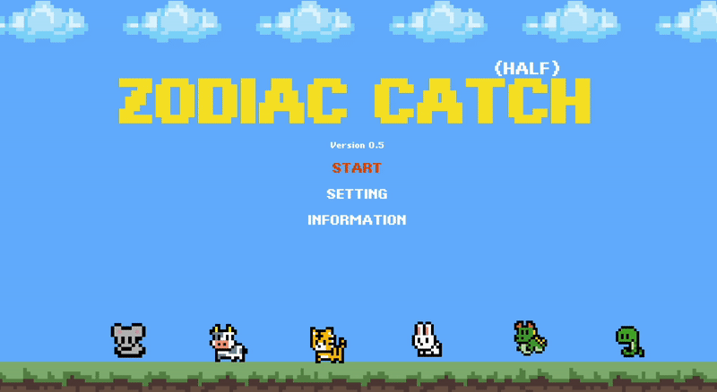

## Link

[PLAY HERE ▶️](https://uob-comsm0166.github.io/2025-group-19/)  
[Weekly Assignment 📚](https://github.com/UoB-COMSM0166/2025-group-19/blob/main/assignments/Readme.md)

# Table of Contents
- [Team Members](#team-members)
- [Introduction](#introduction)
- [Requirements](#requirements)
- [Design](#design)
- [Implementation](#implementation)
- [Evaluation](#evaluation)
- [Process](#process)
- [Conclusion](#conclusion)
- [References](#references)

---
# Team Members

| No.  | Name | Email | Role | 
| :-: | :-: | :-: | :-: |
| 01 | Hsin-Hsien Ho (Erik) | fp24955@bristol.ac.uk | `Developer` |
| 02 | Mingqiao Fan (Daisy) | yi24612@bristol.ac.uk | `Developer` |
| 03 | Shinchuan Chen (Lucas) | wj24296@bristol.ac.uk | `Developer` |
| 04 | Yu-Jin Chen (Elle) | nj24628@bristol.ac.uk | `Developer` |
| 05 | Lee Areta | wb24440@bristol.ac.uk | `Developer` |
| 06 |Mikas Vong | tg24484@bristol.ac.uk | `Developer` |

---
# Introduction

Our game is inspired by the classic brick breaker from the nostalgic era of 1999-2000 (Figure 1). However, we are not merely recreating the old classic—we are giving it a fresh, creative twist. The game incorporates six animals from the Chinese Zodiac, each representing a unique level. Players progress through these levels, collecting each animal as a reward, gaining a sense of achievement with every success.

Each level introduces a distinct visual theme and brick mechanism tailored to the animal it represents, offering new challenges and keeping the gameplay engaging. As players advance, the difficulty increases, putting their skills to the test through ball reflections, speed control, and precision. Additionally, we’ve integrated features such as multi-ball management and power-ups to further enhance the experience.

Are you ready to take on the challenge? Break the bricks, collect the Zodiac animals, and create your own brick-breaking legend!

  <b>Figure 1</b> 
  <i>Block</i> 
  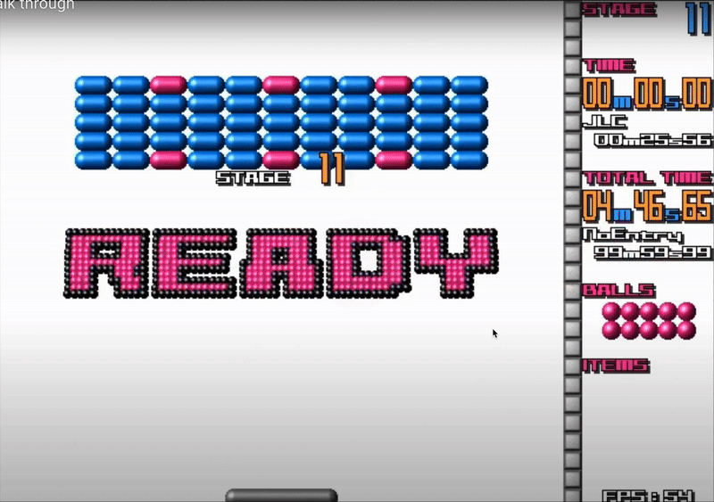

---

# Requirements
## Early Stages design & Ideation process
<table>
    <tr>
        <th>Game Type</th>
        <th>Game Inspiration</th>
        <th>Game Description</th>
        <th>Possible Game Twists</th>
    </tr>
    <tr>
        <td><strong>Block</strong> 🟣</td>
        <td><a href="https://www.youtube.com/watch?v=aU1Hrpr2igM" target="_blank">Watch Gameplay</a></td>
        <td>
            A classic ball-and-brick game where players break bricks by bouncing a ball off a paddle.
        </td>
        <td>
            - Power-Ups: Special bricks drop power-ups like paddle enlargement or extra balls.  
            - Multi-Ball Chaos: Introduce multiple balls with different behaviors.
        </td>
    </tr>
    <tr>
        <td><strong>Bombie</strong> 💣</td>
        <td><a href="https://www.youtube.com/watch?v=W5vcOb7laG0" target="_blank">Watch Gameplay</a></td>
        <td>
            A bomb-based strategy game where players place bombs to destroy walls and eliminate opponents.
        </td>
        <td>
            - Smart AI Opponents: Enemies can strategically place bombs and evade explosions.  
            - Customizable Maps: Players can modify the layout and design of the battlefield.  
        </td>
    </tr>
    <tr>
        <td><strong>Temple Escape</strong> ⛩️</td>
        <td><a href="https://www.youtube.com/watch?v=eCpVc_ELSBk&list=PLEufPunsvT1cysv42S52Y6u59wxtlPb6j&index=1" target="_blank">Watch Gameplay</a></td>
        <td>
            A maze-based puzzle game where players move in straight lines until they hit a wall.
        </td>
        <td>
            - Traps & Timed Puzzles: Moving obstacles force players to think ahead.  
            - Power-ups & Outfits: Collectables provide unique perks.  
        </td>
    </tr>
    <tr>
        <td><strong>Ladder Master</strong> 🪜</td>
        <td><a href="https://www.youtube.com/watch?v=OkTk5ky-GWc" target="_blank">Watch Gameplay</a></td>
        <td>
            A challenging platformer where players must time movements carefully to cross obstacles.
        </td>
        <td>
            - 2D River Crossing: Instead of climbing, make it about crossing a river with unstable platforms.  
            - Character Color Change: Random color changes affect mechanics.
        </td>
    </tr>
    <tr>
        <td><strong>Level Devil</strong> 😈</td>
        <td><a href="https://www.youtube.com/watch?v=nn2EUssloa4" target="_blank">Watch Gameplay</a></td>
        <td>
            A tricky platformer filled with deceptive mechanics and unexpected traps.
        </td>
        <td>
            - Hidden Traps: Fake platforms and misleading paths test the player's observation skills.  
            - Dynamic Triggers: Actions change the level unpredictably.  
        </td>
    </tr>
</table>

## User Stories & Epics
<table>
  <tr>
    <th>Epic</th>
    <th>Stakeholder</th>
    <th>User Story</th>
    <th>Requirement</th>
  </tr>
  <tr>
    <td rowspan="2">Creating an intriguing and various game experience</td>
    <td>User</td>
    <td>
      As a user, I want certain bricks to drop power-ups, such as double points
      or paddle expansion, to add variety to the game.
    </td>
    <td>
      Given certain bricks contain a specific power-up, when the players break
      one of these bricks, then the corresponding power-up, such as double
      points or paddle expansion, will drop for the player to collect.
    </td>
  </tr>
  <tr>
    <td>Speedrun Competitor</td>
    <td>
      As a speedrun competitor, I want to have different records to pass the
      game.
    </td>
    <td>
      Given the game has time trials, when I play the game, then I can try to
      beat my previous records and climb the leaderboard.
    </td>
  </tr>
  <tr>
    <td rowspan="2">Try to learn from failure and frustrations</td>
    <td>Parents</td>
    <td>
      As parents, I want my children to train their focus and reaction speed.
    </td>
    <td>
      Given the increasing difficulty of levels, when the speed of the board
      increases, then the child needs to focus more and react fast to complete
      the level.
    </td>
  </tr>
  <tr>
    <td>Positive Reinforcer</td>
    <td>
      As a person who does better with positive encouragement, I want there to
      be a reward system, so that I’m more motivated to keep playing and
      complete harder levels.
    </td>
    <td>
      Given there is a completion ladder, when a certain level is
      completed/threshold is met, then rewards will be granted.
    </td>
  </tr>
  <tr>
    <td rowspan="2">Training Response Time</td>
    <td>User</td>
    <td>
      As a user, I want to improve my response time so that in the future, when
      something happens, especially in dangerous situations, I can react quickly
      and increase my chances of survival.
    </td>
    <td rowspan="2">
      Given that I want to train my response time, when the ball falls, I must
      catch it within a limited time in order to pass the stage.
    </td>
  </tr>
  <tr>
    <td>Gamer</td>
    <td>
      As a gamer, I want to train my response time so that in the future, when I
      participate in gaming competitions, I can react quickly to increase my
      chances of winning.
    </td>
  </tr>

  <tr>
    <td rowspan="3">Educational</td>
    <td>Physics Teacher</td>
    <td>
      As a physics teacher/professor, I want to make use of the game mechanics
      and physics in an educational setting, so that my students have a more
      visual and interesting way to learn about physics.
    </td>
    <td>
      Given I want to show the concept of momentum to kids, when the kids are in
      the game, then there can be pause so that the motion can be observed in
      more detail (maximized with angles, velocity, etc shown).
    </td>
  </tr>
  <tr>
    <td>Parents</td>
    <td>
      As parents and teachers, I want my kids or students to learn Chinese
      culture through this game, so that they can explore different culture and
      immerse their experience.
    </td>
    <td>
      Given I want to teach kids the concept about Chinese zodiac, when kids
      enter the main page of the game, then they can know the number and the
      animal of Chinese zodiac.
    </td>
  </tr>
  <tr>
    <td>User</td>
    <td>
      As a user, I want to know my Chinese zodiac, so that in the future, I can
      know more about myself and go to fortune teller. When I go to Asian
      countries, I have more topic to have a conversation.
    </td>
    <td>
      Given I want to know my Chinese zodiac, when I enter the game select page
      and enter my birthday, then I can know about my Chinese zodiac.
    </td>
  </tr>
</table>

## Paper Prototype

  <b>Figure 3</b> 
  <i>Paper Prototype - Block</i> 
  

  <b>Figure 4</b> 
  <i>Prototype - Zodiac Catch</i> 
  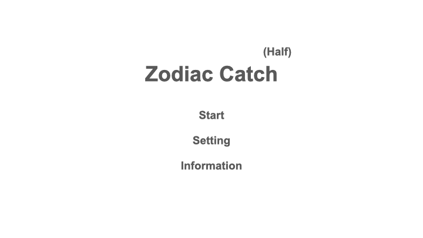

# Design
## Class Diagrams

After creating the paper prototype and sketching our ideas in wireframes, we moved on to designing our game's system architecture through in-person meetings. This process ensured a shared understanding of Object-Oriented Design and served as a reference for our source code.

In our initial meeting, we identified the game's essential components, such as the ball, paddle, and blocks. We then outlined the functions of each component, the unique features of different game stages, and how these elements interact. From this, we developed a basic class diagram.

  <b>Figure 5</b> 
  <i>Initial Class Diagram</i> 
  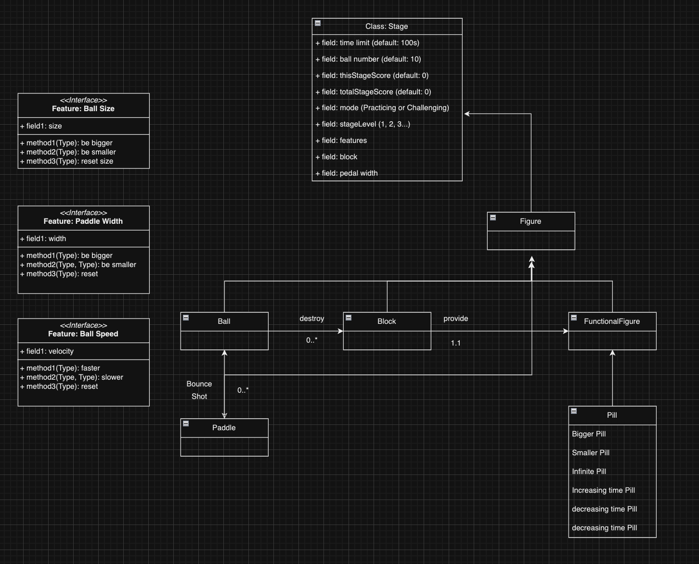

During our first stage of coding, we decided to adopt the **Model-View-Controller (MVC)** design pattern, as it could accommodate our complex features and multiple game views. This led to a more detailed class diagram, which included:
- **Controllers** to handle keyboard input, manage game state across different stages, and activate special features.
- **Views** to define the game's aesthetics and user interface.
- **Models** to store all game components, including the brick patterns for various stages.
This structured approach helped us maintain a clear separation of concerns and facilitated scalable development.

  <b>Figure 6</b> 
  <i>Updated Class Diagram</i> 
  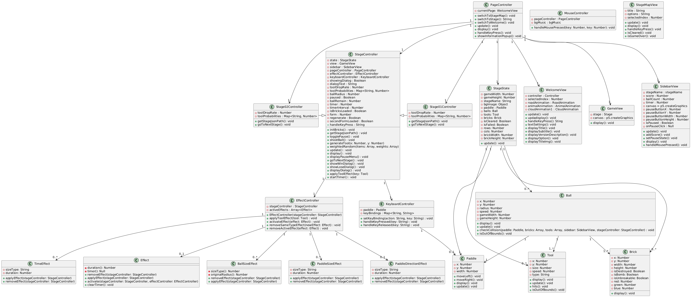

## Sequence Diagram

  <b>Figure 6</b> 
  <i>Sequence Diagram</i> 
  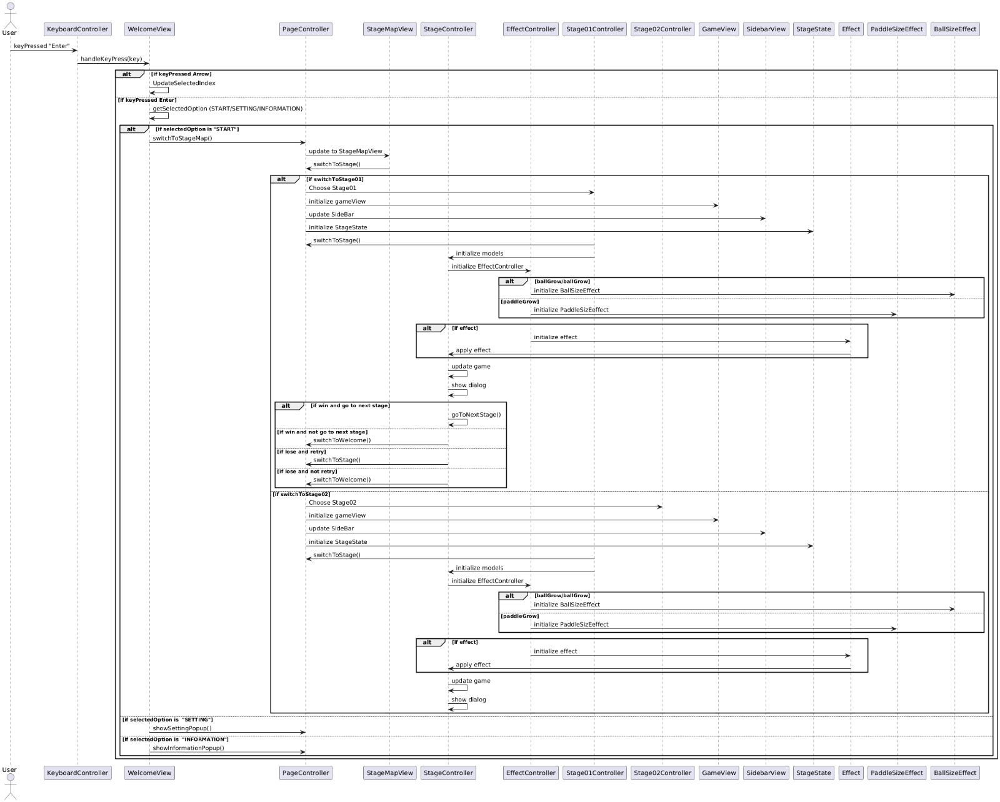

---
# Implementation
Before starting development, we first had to learn how to use the p5.js programming language and get comfortable with object-oriented programming (OOP) to structure our game effectively. As we do the design and planned the implementation, we anticipated several challenges that we thought would be major obstacles. However, once we started coding, these concerns turned out to be more manageable than expected. Instead, we encountered unexpected challenges in other areas. The following sections outline both the anticipated and unforeseen challenges we faced during development and how we addressed them.

## Anticipated Challenges
Before the development stage, we anticipated several challenges:
* **Ball Physics**: We were uncertain whether implementing realistic ball behaviour upon collision, including angle and speed adjustments, would be difficult and require advanced physics knowledge.
* **Difficulty Balancing**: Various factors could influence the game's difficulty, such as ball speed, block patterns, black hole positioning, and the drop rate of power-ups. Managing these to create a balanced experience seemed challenging.  
However, as we progressed, these concerns proved manageable. Since the ball moves without gravity, its position could be updated simply by adding or deducting to its x and y values. For difficulty balancing, we refined the parameters through iterative testing between our group members, and got positive feedback from the user evaluations. 

## Unexpected Challenges
While the above anticipated difficulties were easier to resolve, we faced unexpected challenges during development:
* **Ball Speed in Gravity Mode**  
    One of our power-ups introduces a gravity mode where all balls experience gravitational acceleration.  
    Our initial approach applied a downward acceleration similar to real-world physics. Since each frame represents a fraction of a second, ball speed was measured in pixels per frame. Gravity, as a form of acceleration, changes the ball's velocity, which we simulated by adjusting its vertical speed each frame.  
    However, implementing this became complex due to interactions with other power-ups (such as speed up) and toggle ball, that also influenced the ball speed. During testing, it was difficult to isolate and evaluate the effects of gravity, especially with multiple balls on the screen. 
    
 
      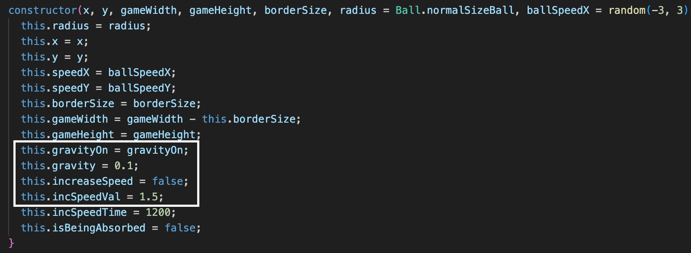      
      <b>Figure X</b> <i>Ball Class Constructor</i>   
      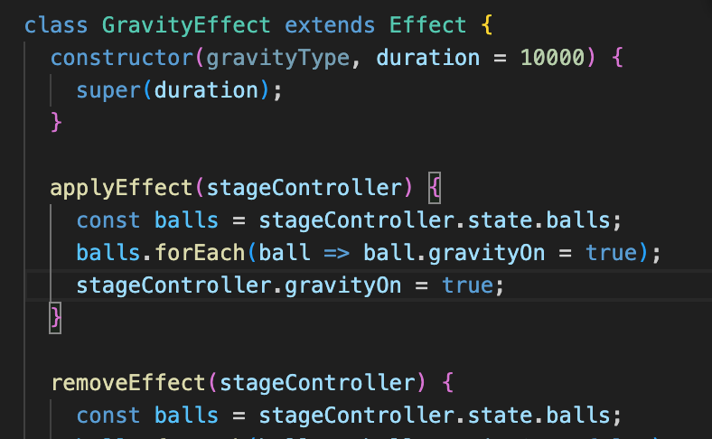       
      <b>Figure X</b><i> An Example of Effect Class</i> 
    

      
    Through the use of clear separation of ball state and effect classes, the game logic became more manageable. All ball properties, including speed and acceleration, are encapsulated within the Ball class. This design ensures that power-ups only modify specific properties rather than overriding entire behaviors. Each power-up acts as a separate effect class that simply toggles certain ball properties on or off, such as enabling gravity or increasing speed. By structuring power-ups as layered modifications rather than direct overrides, we ensured that gravity could be toggled smoothly without disrupting other speed adjustments. This also allowed us to debug individual power-ups in isolation, making it easier to fine-tune their interactions. Ultimately, this approach improved gameplay consistency and made any future enhancements easier to integrate.  
* **Displaying Active Power-Ups and Timers**  
    Another challenge was accurately displaying the active power-ups and their countdowns on the sidebar. Ensuring the correct visuals and timings, particularly when multiple power-ups were active simultaneously, required additional debugging and adjustments. We needed a system that could handle overlapping power-ups, update timers dynamically, and provide a clear visual representation for the player.  
    

      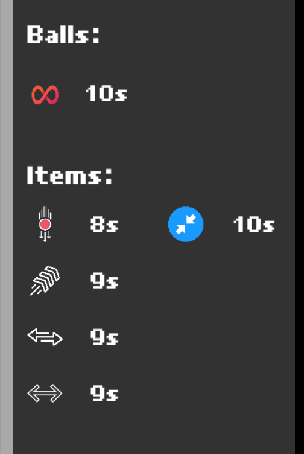 
      <b>Figure X </b><i>Display of Power-Ups in Sidebar</i> 
    

    Implementation Approach:   
    1. Separate Instance for Each Type:
       * When a player collects a power-up, a new timer instance is created for that specific power-up type. This timer continuously tracks the remaining duration.
       * Each power-up type is managed independently to allow multiple active effects at once without interference.
    2. The sidebar dynamically updates to reflect active power-ups, ensuring players can easily see which effects are in play and for how long.
    3. Handling Duplicate Power-Ups:
       * If a player collects the same type of power-up while its effect is still active, the `EffectController` first resets the existing timer instead of creating a new one.
       * The remaining time for that power-up is updated on the sidebar to reflect the newly collected power-up’s extended duration.
       * This prevents power-ups from stacking uncontrollably while ensuring their effect lasts as expected.
    4. Once the timer for a power-up reaches zero, the effect will be removed from the sidebar, indicating the effect is no longer active   

---
# Evaluation
## Qualitative Evaluation
After developing the core mechanics of the game, we conducted Think Aloud user evaluations and Heuristic evaluations to gather feedback on gameplay, difficulty, and overall user experience. This helped us identify areas for improvement and assess how well the game met players' expectations.

### Key Areas of Improvement: 
**Lack of Instructions**: Several users found it unclear which keys or mouse actions were needed to progress through the game. Adding clearer instructions or a tutorial was suggested.  
**Paddle Visibility**: The low contrast between the paddle and the background made it difficult for players to locate the paddle, especially when first entering the game view. This caused confusion about what they could control.  
**Infinity Ball Indicator**: Players struggled to recognize when the Infinity Ball feature was active. Since this mechanic is crucial for progressing through stages, users suggested making its activation more visually apparent.  
**Power-Ups**: The power-ups dropping from bricks were too small for users to distinguish between different types. It was suggested that using distinct colors or shapes could improve clarity.  
**Ball-Paddle Collision Mechanics**: One user recommended that the ball should reflect at different angles depending on where it hits the paddle. This would provide players with greater control and add more variety to the gameplay.  
**Zodiac Year Explanation**: Users wanted more context on the Chinese Zodiac years and how they relate to birthdays. Adding a brief explanation in the stage selection view would help players understand why they should enter their birthdate.  

  <b>Figure 2</b> 
  <i>Zodiac Catch</i> 
  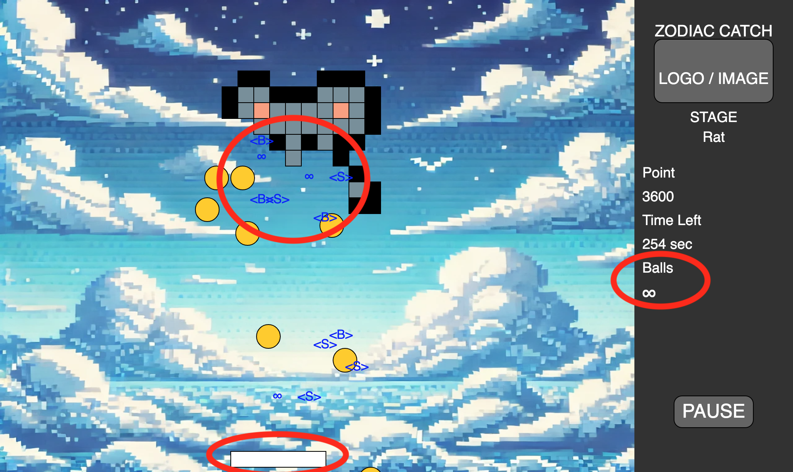

### Aspects Players Enjoyed:  
**Art Design**: Users appreciated the pixel art style of the game, particularly the zodiac animal designs and the consistent pixel-style aesthetic, including the fonts and background.  
**Difficulty Balance**: Players noted that the speed and number of balls provided the right level of challenge, making the game engaging without being too easy or too difficult.  
**Power-Ups**: The variety and design of the power-ups were enjoyable, adding fun and excitement to the gameplay.  
### Heuristic Evaluation: 
<table align="center">
  <tr>
    <th align="center">Interface Issue</th>
    <th align="center">Issues</th>
    <th align="center">Heuristic(s)</th>
    <th align="center">Frequency</th>
    <th align="center">Impact</th>
    <th align="center">Persistence</th>
    <th align="center">Severity</th>
  </tr>
  <tr>
    <td align="center">Stage Map</td>
    <td align="center">Confusing about how to pin in birthday and why?</td>
    <td align="center">Visibility of system status, User control and freedom</td>
    <td align="center">4</td>
    <td align="center">4</td>
    <td align="center">4</td>
    <td align="center">4</td>
  </tr>
  <tr>
    <td align="center">Game View</td>
    <td align="center">Celing and Sidewall is invisiable</td>
    <td align="center">User control and freedom</td>
    <td align="center">2</td>
    <td align="center">1</td>
    <td align="center">1</td>
    <td align="center">1.33</td>
  </tr>
  <tr>
    <td align="center">Game View</td>
    <td align="center">colour of the background and paddle clash</td>
    <td align="center">Visibility of system status</td>
    <td align="center">4</td>
    <td align="center">1</td>
    <td align="center">4</td>
    <td align="center">3</td>
  </tr>
  <tr>
    <td align="center">Game View</td>
    <td align="center">wish that there were more visual cues to notify that a power up has been eaten</td>
    <td align="center">Visibility of system status</td>
    <td align="center">4</td>
    <td align="center">1</td>
    <td align="center">1</td>
    <td align="center">2</td>
  </tr>
  <tr>
    <td align="center">Stage Selection</td>
    <td align="center">Unclear that user can enter their birth year, may be better to add a cursor
there</td>
    <td align="center">Visibility of system status</td>
    <td align="center">3</td>
    <td align="center">2</td>
    <td align="center">1</td>
    <td align="center">2</td>
  </tr>
</table>

## Quantitative Evaluation
### USER FEEDBACK
#### NASA TLX
<table align="center">
  <tr>
    <th align="center">User</th>
    <th align="center">Difficulty</th>
    <th align="center">Mental Demand</th>
    <th align="center">Physical Demand</th>
    <th align="center">Temporal Demand</th>
    <th align="center">Performance</th>
    <th align="center">Effort</th>
    <th align="center">Frustration</th>
    <th align="center">Score</th>
  </tr>
  <tr>
    <th align="center">User1</th>
    <th align="center">Easy</th>
    <th align="center">5</th>
    <th align="center">7</th>
    <th align="center">16</th>
    <th align="center">21</th>
    <th align="center">18</th>
    <th align="center">2</th>
    <th align="center">52.5</th>
  </tr>
  <tr>
    <th align="center"></th>
    <th align="center">Hard</th>
    <th align="center">11</th>
    <th align="center">12</th>
    <th align="center">12</th>
    <th align="center">18</th>
    <th align="center">13</th>
    <th align="center">7</th>
    <th align="center">55.8</th>
  </tr>
  <tr>
    <th align="center">User2</th>
    <th align="center">Easy</th>
    <th align="center">5</th>
    <th align="center">4</th>
    <th align="center">9</th>
    <th align="center">11</th>
    <th align="center">11</th>
    <th align="center">6</th>
    <th align="center">33</th>
  </tr>
  <tr>
    <th align="center"></th>
    <th align="center">Hard</th>
    <th align="center">5</th>
    <th align="center">8</th>
    <th align="center">15</th>
    <th align="center">21</th>
    <th align="center">17</th>
    <th align="center">6</th>
    <th align="center">55</th>
  </tr>
  <tr>
    <th align="center">User3</th>
    <th align="center">Easy</th>
    <th align="center">1</th>
    <th align="center">1</th>
    <th align="center">11</th>
    <th align="center">16</th>
    <th align="center">19</th>
    <th align="center">5</th>
    <th align="center">39.1</th>
  </tr>
  <tr>
    <th align="center"></th>
    <th align="center">Hard</th>
    <th align="center">1</th>
    <th align="center">1</th>
    <th align="center">11</th>
    <th align="center">17</th>
    <th align="center">21</th>
    <th align="center">15</th>
    <th align="center">50</th>
  </tr>
  <tr>
    <th align="center">User4</th>
    <th align="center">Easy</th>
    <th align="center">14</th>
    <th align="center">19</th>
    <th align="center">19</th>
    <th align="center">11</th>
    <th align="center">15</th>
    <th align="center">12</th>
    <th align="center">70</th>
  </tr>
  <tr>
    <th align="center"></th>
    <th align="center">Hard</th>
    <th align="center">14</th>
    <th align="center">18</th>
    <th align="center">18</th>
    <th align="center">19</th>
    <th align="center">16</th>
    <th align="center">12</th>
    <th align="center">75.8</th>
  </tr>
  <tr>
    <th align="center">User5</th>
    <th align="center">Easy</th>
    <th align="center">5</th>
    <th align="center">5</th>
    <th align="center">2</th>
    <th align="center">20</th>
    <th align="center">3</th>
    <th align="center">2</th>
    <th align="center">25.8</th>
  </tr>
  <tr>
    <th align="center"></th>
    <th align="center">Hard</th>
    <th align="center">8</th>
    <th align="center">4</th>
    <th align="center">3</th>
    <th align="center">16</th>
    <th align="center">11</th>
    <th align="center">4</th>
    <th align="center">33.3</th>
  </tr>
  <tr>
    <th align="center">User6</th>
    <th align="center">Easy</th>
    <th align="center">11</th>
    <th align="center">11</th>
    <th align="center">7</th>
    <th align="center">20</th>
    <th align="center">6</th>
    <th align="center">3</th>
    <th align="center">43.4</th>
  </tr>
  <tr>
    <th align="center"></th>
    <th align="center">Hard</th>
    <th align="center">12</th>
    <th align="center">14</th>
    <th align="center">14</th>
    <th align="center">17</th>
    <th align="center">11</th>
    <th align="center">6</th>
    <th align="center">56.7</th>
  </tr>
  <tr>
    <th align="center">User7</th>
    <th align="center">Easy</th>
    <th align="center">11</th>
    <th align="center">16</th>
    <th align="center">16</th>
    <th align="center">13</th>
    <th align="center">13</th>
    <th align="center">15</th>
    <th align="center">65</th>
  </tr>
  <tr>
    <th align="center"></th>
    <th align="center">Hard</th>
    <th align="center">15</th>
    <th align="center">19</th>
    <th align="center">17</th>
    <th align="center">11</th>
    <th align="center">13</th>
    <th align="center">17</th>
    <th align="center">71.7</th>
  </tr>
  <tr>
    <th align="center">User8</th>
    <th align="center">Easy</th>
    <th align="center">5</th>
    <th align="center">5</th>
    <th align="center">13</th>
    <th align="center">19</th>
    <th align="center">5</th>
    <th align="center">12</th>
    <th align="center">44.2</th>
  </tr>
  <tr>
    <th align="center"></th>
    <th align="center">Hard</th>
    <th align="center">19</th>
    <th align="center">8</th>
    <th align="center">16</th>
    <th align="center">17</th>
    <th align="center">14</th>
    <th align="center">11</th>
    <th align="center">65.8</th>
  </tr>
  <tr>
    <th align="center">User9</th>
    <th align="center">Easy</th>
    <th align="center">6</th>
    <th align="center">3</th>
    <th align="center">7</th>
    <th align="center">15</th>
    <th align="center">6</th>
    <th align="center">7</th>
    <th align="center">31.7</th>
  </tr>
  <tr>
    <th align="center"></th>
    <th align="center">Hard</th>
    <th align="center">7</th>
    <th align="center">3</th>
    <th align="center">8</th>
    <th align="center">15</th>
    <th align="center">7</th>
    <th align="center">7</th>
    <th align="center">34.3</th>
  </tr>
  <tr>
    <th align="center">User10</th>
    <th align="center">Easy</th>
    <th align="center">15</th>
    <th align="center">15</th>
    <th align="center">17</th>
    <th align="center">15</th>
    <th align="center">16</th>
    <th align="center">13</th>
    <th align="center">70.8</th>
  </tr>
  <tr>
    <th align="center"></th>
    <th align="center">Hard</th>
    <th align="center">18</th>
    <th align="center">18</th>
    <th align="center">19</th>
    <th align="center">13</th>
    <th align="center">17</th>
    <th align="center">17</th>
    <th align="center">80</th>
  </tr>
  <tr>
    <th align="center">User11</th>
    <th align="center">Easy</th>
    <th align="center">1</th>
    <th align="center">7</th>
    <th align="center">1</th>
    <th align="center">21</th>
    <th align="center">3</th>
    <th align="center">1</th>
    <th align="center">23.3</th>
  </tr>
  <tr>
    <th align="center"></th>
    <th align="center">Hard</th>
    <th align="center">1</th>
    <th align="center">4</th>
    <th align="center">14</th>
    <th align="center">16</th>
    <th align="center">12</th>
    <th align="center">7</th>
    <th align="center">37.5</th>
  </tr>
  <tr>
    <th align="center">User12</th>
    <th align="center">Easy</th>
    <th align="center">15</th>
    <th align="center">15</th>
    <th align="center">16</th>
    <th align="center">17</th>
    <th align="center">19</th>
    <th align="center">11</th>
    <th align="center">72.5</th>
  </tr>
  <tr>
    <th align="center"></th>
    <th align="center">Hard</th>
    <th align="center">13</th>
    <th align="center">12</th>
    <th align="center">12</th>
    <th align="center">14</th>
    <th align="center">12</th>
    <th align="center">15</th>
    <th align="center">60</th>
  </tr>
  <tr>
    <th align="center">User13</th>
    <th align="center">Easy</th>
    <th align="center">5</th>
    <th align="center">5</th>
    <th align="center">15</th>
    <th align="center">18</th>
    <th align="center">3</th>
    <th align="center">4</th>
    <th align="center">36.7</th>
  </tr>
  <tr>
    <th align="center"></th>
    <th align="center">Hard</th>
    <th align="center">4</th>
    <th align="center">4</th>
    <th align="center">13</th>
    <th align="center">17</th>
    <th align="center">4</th>
    <th align="center">4</th>
    <th align="center">33.3</th>
  </tr>
  <tr>
    <th align="center">User14</th>
    <th align="center">Easy</th>
    <th align="center">16</th>
    <th align="center">20</th>
    <th align="center">16</th>
    <th align="center">18</th>
    <th align="center">18</th>
    <th align="center">8</th>
    <th align="center">75</th>
  </tr>
  <tr>
    <th align="center"></th>
    <th align="center">Hard</th>
    <th align="center">18</th>
    <th align="center">20</th>
    <th align="center">20</th>
    <th align="center">13</th>
    <th align="center">19</th>
    <th align="center">8</th>
    <th align="center">71.2</th>
  </tr>
</table>

  <b>NASA TLX W test statistic = 17</b> 

#### System Usability Scale
<table align="center">
  <tr>
    <th align="center">User</th>
    <th align="center">Difficulty</th>
    <th align="center">1</th>
    <th align="center">2</th>
    <th align="center">3</th>
    <th align="center">4</th>
    <th align="center">5</th>
    <th align="center">6</th>
    <th align="center">7</th>
    <th align="center">8</th>
    <th align="center">9</th>
    <th align="center">10</th>
    <th align="center">Score</th>
  </tr>
  <tr>
    <th align="center">User1</th>
    <th align="center">Easy</th>
    <th align="center">5</th>
    <th align="center">1</th>
    <th align="center">5</th>
    <th align="center">1</th>
    <th align="center">5</th>
    <th align="center">1</th>
    <th align="center">5</th>
    <th align="center">1</th>
    <th align="center">5</th>
    <th align="center">1</th>
    <th align="center">100</th>
  </tr>
  <tr>
    <th align="center"></th>
    <th align="center">Hard</th>
    <th align="center">5</th>
    <th align="center">1</th>
    <th align="center">5</th>
    <th align="center">1</th>
    <th align="center">5</th>
    <th align="center">1</th>
    <th align="center">5</th>
    <th align="center">1</th>
    <th align="center">3</th>
    <th align="center">1</th>
    <th align="center">95</th>
  </tr>
  <tr>
    <th align="center">User2</th>
    <th align="center">Easy</th>
    <th align="center">1</th>
    <th align="center">1</th>
    <th align="center">4</th>
    <th align="center">2</th>
    <th align="center">4</th>
    <th align="center">2</th>
    <th align="center">4</th>
    <th align="center">2</th>
    <th align="center">5</th>
    <th align="center">1</th>
    <th align="center">75</th>
  </tr>
  <tr>
    <th align="center"></th>
    <th align="center">Hard</th>
    <th align="center">5</th>
    <th align="center">1</th>
    <th align="center">5</th>
    <th align="center">1</th>
    <th align="center">5</th>
    <th align="center">1</th>
    <th align="center">5</th>
    <th align="center">1</th>
    <th align="center">3</th>
    <th align="center">1</th>
    <th align="center">75</th>
  </tr>
  <tr>
    <th align="center">User3</th>
    <th align="center">Easy</th>
    <th align="center">4</th>
    <th align="center">1</th>
    <th align="center">4</th>
    <th align="center">2</th>
    <th align="center">4</th>
    <th align="center">1</th>
    <th align="center">5</th>
    <th align="center">1</th>
    <th align="center">4</th>
    <th align="center">3</th>
    <th align="center">82.5</th>
  </tr>
  <tr>
    <th align="center"></th>
    <th align="center">Hard</th>
    <th align="center">4</th>
    <th align="center">1</th>
    <th align="center">4</th>
    <th align="center">2</th>
    <th align="center">4</th>
    <th align="center">1</th>
    <th align="center">5</th>
    <th align="center">1</th>
    <th align="center">3</th>
    <th align="center">3</th>
    <th align="center">82.5</th>
  </tr>
  <tr>
    <th align="center">User4</th>
    <th align="center">Easy</th>
    <th align="center">5</th>
    <th align="center">2</th>
    <th align="center">3</th>
    <th align="center">2</th>
    <th align="center">5</th>
    <th align="center">1</th>
    <th align="center">3</th>
    <th align="center">1</th>
    <th align="center">5</th>
    <th align="center">2</th>
    <th align="center">82.5</th>
  </tr>
  <tr>
    <th align="center"></th>
    <th align="center">Hard</th>
    <th align="center">5</th>
    <th align="center">2</th>
    <th align="center">3</th>
    <th align="center">2</th>
    <th align="center">5</th>
    <th align="center">1</th>
    <th align="center">3</th>
    <th align="center">1</th>
    <th align="center">5</th>
    <th align="center">2</th>
    <th align="center">82.5</th>
  </tr>
  <tr>
    <th align="center">User5</th>
    <th align="center">Easy</th>
    <th align="center">3</th>
    <th align="center">4</th>
    <th align="center">3</th>
    <th align="center">3</th>
    <th align="center">4</th>
    <th align="center">3</th>
    <th align="center">4</th>
    <th align="center">3</th>
    <th align="center">3</th>
    <th align="center">4</th>
    <th align="center">50</th>
  </tr>
  <tr>
    <th align="center"></th>
    <th align="center">Hard</th>
    <th align="center">3</th>
    <th align="center">4</th>
    <th align="center">3</th>
    <th align="center">4</th>
    <th align="center">3</th>
    <th align="center">3</th>
    <th align="center">4</th>
    <th align="center">3</th>
    <th align="center">3</th>
    <th align="center">4</th>
    <th align="center">45</th>
  </tr>
  <tr>
    <th align="center">User6</th>
    <th align="center">Easy</th>
    <th align="center">4</th>
    <th align="center">3</th>
    <th align="center">5</th>
    <th align="center">1</th>
    <th align="center">4</th>
    <th align="center">2</th>
    <th align="center">5</th>
    <th align="center">2</th>
    <th align="center">4</th>
    <th align="center">1</th>
    <th align="center">82.5</th>
  </tr>
  <tr>
    <th align="center"></th>
    <th align="center">Hard</th>
    <th align="center">5</th>
    <th align="center">2</th>
    <th align="center">4</th>
    <th align="center">2</th>
    <th align="center">3</th>
    <th align="center">2</th>
    <th align="center">4</th>
    <th align="center">2</th>
    <th align="center">4</th>
    <th align="center">2</th>
    <th align="center">75</th>
  </tr>
  <tr>
    <th align="center">User7</th>
    <th align="center">Easy</th>
    <th align="center">2</th>
    <th align="center">1</th>
    <th align="center">5</th>
    <th align="center">1</th>
    <th align="center">5</th>
    <th align="center">1</th>
    <th align="center">5</th>
    <th align="center">1</th>
    <th align="center">5</th>
    <th align="center">1</th>
    <th align="center">92.5</th>
  </tr>
  <tr>
    <th align="center"></th>
    <th align="center">Hard</th>
    <th align="center">2</th>
    <th align="center">1</th>
    <th align="center">5</th>
    <th align="center">1</th>
    <th align="center">5</th>
    <th align="center">1</th>
    <th align="center">5</th>
    <th align="center">1</th>
    <th align="center">5</th>
    <th align="center">1</th>
    <th align="center">92.5</th>
  </tr>
  <tr>
    <th align="center">User8</th>
    <th align="center">Easy</th>
    <th align="center">3</th>
    <th align="center">4</th>
    <th align="center">2</th>
    <th align="center">4</th>
    <th align="center">4</th>
    <th align="center">3</th>
    <th align="center">4</th>
    <th align="center">3</th>
    <th align="center">3</th>
    <th align="center">4</th>
    <th align="center">45</th>
  </tr>
  <tr>
    <th align="center"></th>
    <th align="center">Hard</th>
    <th align="center">3</th>
    <th align="center">3</th>
    <th align="center">2</th>
    <th align="center">4</th>
    <th align="center">4</th>
    <th align="center">3</th>
    <th align="center">3</th>
    <th align="center">3</th>
    <th align="center">2</th>
    <th align="center">4</th>
    <th align="center">42.5</th>
  </tr>
  <tr>
    <th align="center">User9</th>
    <th align="center">Easy</th>
    <th align="center">5</th>
    <th align="center">1</th>
    <th align="center">5</th>
    <th align="center">3</th>
    <th align="center">4</th>
    <th align="center">2</th>
    <th align="center">5</th>
    <th align="center">1</th>
    <th align="center">5</th>
    <th align="center">2</th>
    <th align="center">87.5</th>
  </tr>
  <tr>
    <th align="center"></th>
    <th align="center">Hard</th>
    <th align="center">5</th>
    <th align="center">3</th>
    <th align="center">5</th>
    <th align="center">3</th>
    <th align="center">4</th>
    <th align="center">1</th>
    <th align="center">4</th>
    <th align="center">2</th>
    <th align="center">5</th>
    <th align="center">2</th>
    <th align="center">80</th>
  </tr>
  <tr>
    <th align="center">User10</th>
    <th align="center">Easy</th>
    <th align="center">4</th>
    <th align="center">2</th>
    <th align="center">5</th>
    <th align="center">4</th>
    <th align="center">3</th>
    <th align="center">3</th>
    <th align="center">5</th>
    <th align="center">3</th>
    <th align="center">3</th>
    <th align="center">2</th>
    <th align="center">65</th>
  </tr>
  <tr>
    <th align="center"></th>
    <th align="center">Hard</th>
    <th align="center">4</th>
    <th align="center">4</th>
    <th align="center">5</th>
    <th align="center">4</th>
    <th align="center">4</th>
    <th align="center">2</th>
    <th align="center">4</th>
    <th align="center">3</th>
    <th align="center">4</th>
    <th align="center">2</th>
    <th align="center">65</th>
  </tr>
  <tr>
    <th align="center">User11</th>
    <th align="center">Easy</th>
    <th align="center">4</th>
    <th align="center">3</th>
    <th align="center">4</th>
    <th align="center">2</th>
    <th align="center">3</th>
    <th align="center">2</th>
    <th align="center">4</th>
    <th align="center">2</th>
    <th align="center">4</th>
    <th align="center">2</th>
    <th align="center">70</th>
  </tr>
  <tr>
    <th align="center"></th>
    <th align="center">Hard</th>
    <th align="center">4</th>
    <th align="center">2</th>
    <th align="center">4</th>
    <th align="center">2</th>
    <th align="center">4</th>
    <th align="center">2</th>
    <th align="center">5</th>
    <th align="center">1</th>
    <th align="center">4</th>
    <th align="center">1</th>
    <th align="center">82.5</th>
  </tr>
  <tr>
    <th align="center">User12</th>
    <th align="center">Easy</th>
    <th align="center">4</th>
    <th align="center">2</th>
    <th align="center">3</th>
    <th align="center">4</th>
    <th align="center">4</th>
    <th align="center">2</th>
    <th align="center">3</th>
    <th align="center">2</th>
    <th align="center">3</th>
    <th align="center">4</th>
    <th align="center">57.5</th>
  </tr>
  <tr>
    <th align="center"></th>
    <th align="center">Hard</th>
    <th align="center">4</th>
    <th align="center">2</th>
    <th align="center">2</th>
    <th align="center">4</th>
    <th align="center">4</th>
    <th align="center">2</th>
    <th align="center">3</th>
    <th align="center">2</th>
    <th align="center">3</th>
    <th align="center">4</th>
    <th align="center">55</th>
  </tr>
  <tr>
    <th align="center">User13</th>
    <th align="center">Easy</th>
    <th align="center">5</th>
    <th align="center">2</th>
    <th align="center">5</th>
    <th align="center">4</th>
    <th align="center">5</th>
    <th align="center">1</th>
    <th align="center">5</th>
    <th align="center">2</th>
    <th align="center">4</th>
    <th align="center">3</th>
    <th align="center">80</th>
  </tr>
  <tr>
    <th align="center"></th>
    <th align="center">Hard</th>
    <th align="center">4</th>
    <th align="center">2</th>
    <th align="center">5</th>
    <th align="center">4</th>
    <th align="center">5</th>
    <th align="center">1</th>
    <th align="center">5</th>
    <th align="center">2</th>
    <th align="center">4</th>
    <th align="center">3</th>
    <th align="center">77.5</th>
  </tr>
  <tr>
    <th align="center">User14</th>
    <th align="center">Easy</th>
    <th align="center">5</th>
    <th align="center">1</th>
    <th align="center">4</th>
    <th align="center">2</th>
    <th align="center">5</th>
    <th align="center">1</th>
    <th align="center">4</th>
    <th align="center">1</th>
    <th align="center">5</th>
    <th align="center">2</th>
    <th align="center">85</th>
  </tr>
  <tr>
    <th align="center"></th>
    <th align="center">Hard</th>
    <th align="center">5</th>
    <th align="center">1</th>
    <th align="center">4</th>
    <th align="center">3</th>
    <th align="center">5</th>
    <th align="center">1</th>
    <th align="center">4</th>
    <th align="center">1</th>
    <th align="center">4</th>
    <th align="center">3</th>
    <th align="center">82.5</th>
  </tr>

</table>

  <b>SUS W test statistic = 10</b> 

### FINDING
Based on the Wilcoxon Signed-Rank Test:

-  By using the Wilcoxon Signed Rank Test, we obtained a score of 10 for the System Usability Survey (SUS) and a score of 17 for NASA TLX from surveys collected from 14 users. The alpha value is set to 0.05.

-  The NASA-TLX score is statistically significant, indicating that there may be a significant difference in the perception of workload between the easy and hard levels. From the user data, it can be observed that temporal demand and physical demand are usually high when users are playing the hard level. High temporal demand suggests that users may feel pressed for time while using the system, possibly indicating that tasks are too fast-paced. High physical demand indicates that users need to pay significant effort to interact with the system, which may be due to complex controls, excessive manual input, or inefficient workflows.
  
-  The SUS score is not statistically significant, suggesting that there is no significant difference in usability between the easy and hard levels. This implies that the system’s usability is perceived similarly across different difficulty levels. The average SUS score is 74.46 among the 14 surveys, which is above the average of 68. A score of 74.46 can be seen as a good indicator that users did not struggle significantly with using the system. While 74.46 is above average, excellent usability scores are above 80 so this suggests there is still room for improvement in certain areas to make the system even more intuitive and user-friendly.

-  Improvements based on NASA TLX: Simplify processes or enhance feedback mechanisms.
   
-  Improvements based on SUS:  Reduce temporal demand by allowing more flexible pacing or simplifying steps. Reduce physical demand by optimizing input methods and minimizing unnecessary actions.

---
# Process
## Zenhub Kanban

In our project, we use ZenHub as our project management tool due to its key advantages:

1. **Seamless GitHub Integration**: ZenHub is embedded directly within GitHub, enabling developers to manage tasks without switching between platforms, improving efficiency.
2. **Browser Extension Support**: ZenHub offers a browser extension that integrates seamlessly into the GitHub repository interface, allowing project management directly within the repo view.
3. **Epics Support**: ZenHub provides Epics to group related issues and manage larger tasks, a feature that GitHub Projects lacks.

Additionally, ZenHub’s deep integration ensures that creating or updating issues in ZenHub is synchronized with GitHub in real-time, maintaining data consistency. Overall, ZenHub’s capabilities and tight GitHub integration make it an ideal choice for our project management.

  <b>Figure</b> 
  <i>Zenhub integrate Github</i> 
  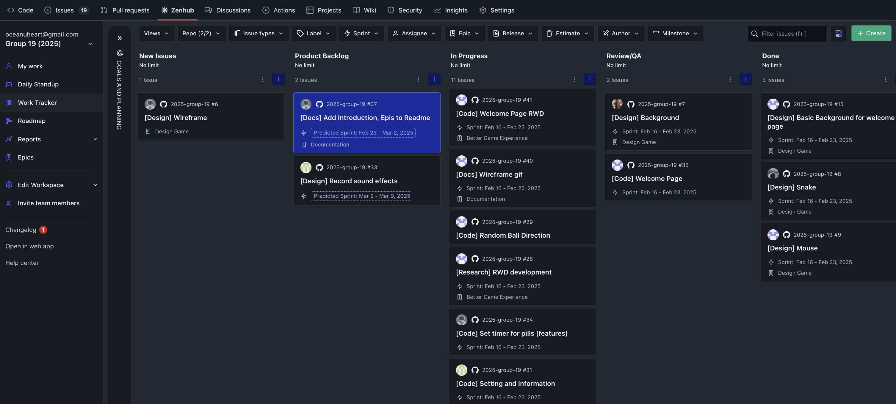

## Whimsical Wireframe

We use Whimsical to store and organize our `brainstorming drafts`, `level wireframes`, `mind maps`, and other project ideas. It provides real-time collaboration, allowing our team to work together seamlessly, co-edit documents, and share feedback instantly. Additionally, the sticky note feature enables quick discussions and idea exchanges, fostering smooth communication within the team. Its intuitive interface and versatile tools make it an essential part of our workflow for efficient planning and coordination.

  <b>Figure</b> 
  <i>Whimsical</i> 
  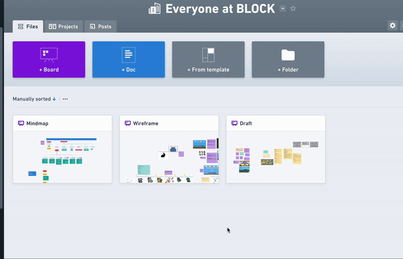

---
# Conclusion

# References
