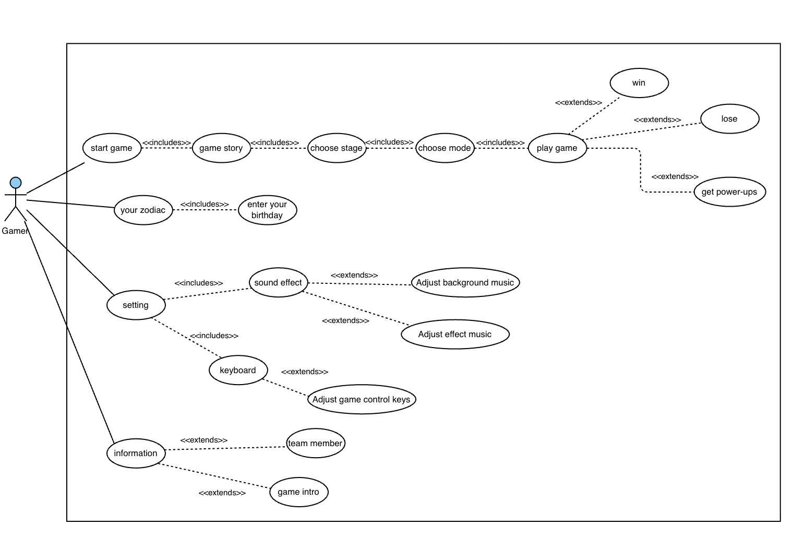
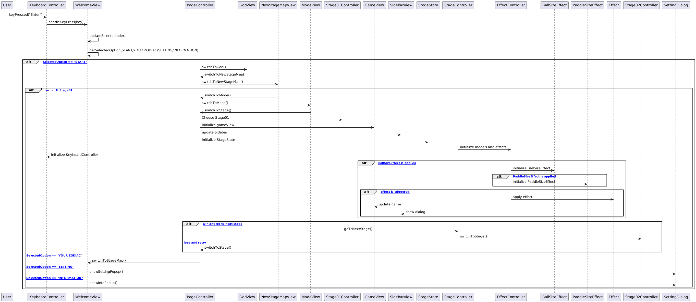
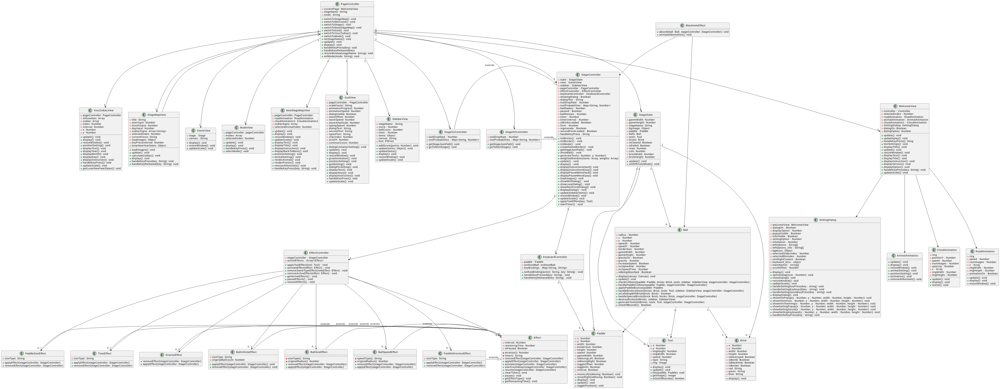
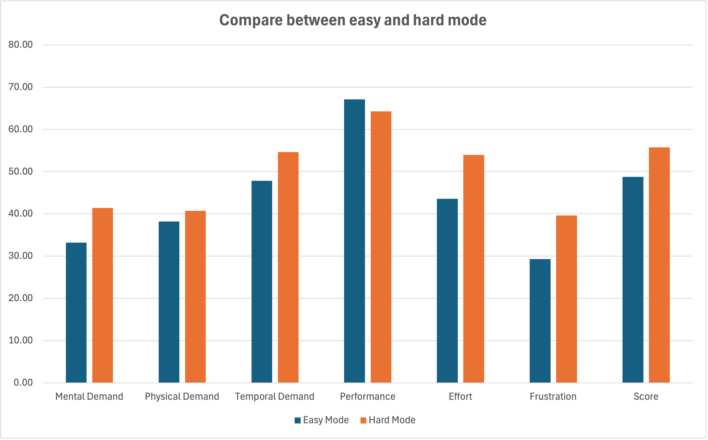
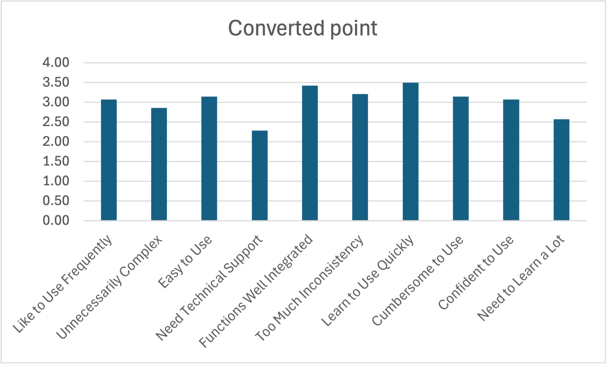

# 2025-group-19
2025 COMSM0166 group 19

# Our Game - ZODIAC CATCH

    

## Links

[PLAY HERE ▶️](https://uob-comsm0166.github.io/2025-group-19/)  
[Weekly Assignment 📚](https://github.com/UoB-COMSM0166/2025-group-19/blob/main/assignments/Readme.md)

# Table of Contents
- [Team Members](#team-members)
- [Introduction](#introduction)
- [Requirements](#requirements)
- [Design](#design)
- [Implementation](#implementation)
- [Evaluation](#evaluation)
- [Process](#process)
- [Sustainability, ethics, and accessibility](#sustainability-ethics-and-accessibility)
- [Conclusion](#conclusion)

---
# Team Members

| No.  | Name | Email | Role | 
| :-: | :-: | :-: | :-: |
| 01 | Hsin-Hsien Ho (Erik) | fp24955@bristol.ac.uk | `Developer` |
| 02 | Mingqiao Fan (Daisy) | yi24612@bristol.ac.uk | `Developer` |
| 03 | Shinchuan Chen (Lucas) | wj24296@bristol.ac.uk | `Developer` |
| 04 | Yu-Jin Chen (Elle) | nj24628@bristol.ac.uk | `Developer` |
| 05 | Lee Areta | wb24440@bristol.ac.uk | `Developer` |
| 06 |Mikas Vong | tg24484@bristol.ac.uk | `Developer` |

---
# Introduction

A fresh take on the beloved brick breaker, our game was inspired by and pays homage to the genre’s rich history that spans titles such as the original Breakout by Atari and Block.

  <b>Figure 1</b> 
  <i>Block</i> 
  

Like its predecessors, you use a paddle to control a limited amount of balls in order to destroy all playable blocks in a given level. Broken blocks have a chance of dropping power-ups that either aid or hinder your progress depending on the difficulty level. Bombs scattered throughout the levels also provide a means of removing rows more efficiently. 

As a unique twist, all levels in Zodiac Catch contain an unexpected element - blackholes. Unlike normal bricks, these are not only unbreakable, but cause any balls that hit them to be lost forever. The locations of these special bricks remain unknown until you encounter one. Thus, it is up to the player to tactically avoid them during their gameplay run.

To further put a spin on the typically non-narrative genre, our game is themed after the Chinese zodiac. Each stage corresponds to an animal from the twelve-year cycle: rat, ox, tiger, rabbit, dragon, snake, horse, goat, monkey, rooster, dog and pig. A bonus "Your Zodiac" feature can also be found on the main page. There, you can enter your birth year to find the zodiac animal that represents you. 

  <b>Figure 2</b> 
  <i>12 zodiac animals</i> 
  

With fast-paced action and engaging mechanics, Zodiac Catch is a great way to put your video gaming skills to the test and learn about Chinese mythology along the way.

---

# Requirements
In the early stages of our project, each of the team members came up with an idea based on existing game archetypes. We took inspiration from personal interests whilst also considering how feasible it would be to develop our ideas from scratch. To facilitate creative brainstorming, we used Google Docs to record ideas and suggestions, enabling real-time sharing and collaboration.

<table>
    <tr>
        <th>Game Type</th>
        <th>Game Inspiration</th>
        <th>Game Description</th>
        <th>Possible Game Twists</th>
    </tr>
    <tr>
        <td><strong>Block</strong> 🟣</td>
        <td><a href="https://www.youtube.com/watch?v=aU1Hrpr2igM" target="_blank">Watch Gameplay</a></td>
        <td>
            A classic ball-and-brick game where players break bricks by bouncing a ball off a paddle.
        </td>
        <td>
            - Power-Ups: Special bricks drop power-ups like paddle enlargement or extra balls.  
            - Multi-Ball Chaos: Introduce multiple balls with different behaviours.
        </td>
    </tr>
    <tr>
        <td><strong>Bombie</strong> 💣</td>
        <td><a href="https://www.youtube.com/watch?v=W5vcOb7laG0" target="_blank">Watch Gameplay</a></td>
        <td>
            A bomb-based strategy game where players place bombs to destroy walls and eliminate opponents.
        </td>
        <td>
            - Smart AI Opponents: Enemies can strategically place bombs and evade explosions.  
            - Customisable Maps: Players can modify the layout and design of the battlefield.  
        </td>
    </tr>
    <tr>
        <td><strong>Temple Escape</strong> ⛩️</td>
        <td><a href="https://www.youtube.com/watch?v=eCpVc_ELSBk&list=PLEufPunsvT1cysv42S52Y6u59wxtlPb6j&index=1" target="_blank">Watch Gameplay</a></td>
        <td>
            A maze-based puzzle game where players move in straight lines until they hit a wall.
        </td>
        <td>
            - Traps & Timed Puzzles: Moving obstacles force players to think ahead.  
            - Power-ups & Outfits: Collectables provide unique perks.  
        </td>
    </tr>
    <tr>
        <td><strong>Ladder Master</strong> 🪜</td>
        <td><a href="https://www.youtube.com/watch?v=OkTk5ky-GWc" target="_blank">Watch Gameplay</a></td>
        <td>
            A challenging platformer where players must time movements carefully to cross obstacles.
        </td>
        <td>
            - 2D River Crossing: Instead of climbing, make it about crossing a river with unstable platforms.  
            - Character Color Change: Random color changes affect mechanics.
        </td>
    </tr>
    <tr>
        <td><strong>Level Devil</strong> 😈</td>
        <td><a href="https://www.youtube.com/watch?v=nn2EUssloa4" target="_blank">Watch Gameplay</a></td>
        <td>
            A tricky platformer filled with deceptive mechanics and unexpected traps.
        </td>
        <td>
            - Hidden Traps: Fake platforms and misleading paths test the player's observation skills.  
            - Dynamic Triggers: Actions change the level unpredictably.  
        </td>
    </tr>
</table>

  <b>Figure 3</b> 
  <i>Brainstormed Game Ideas on Google Docs</i> 
  

## Early Stage Design
During the first meeting, where we presented and voted on our respective proposals, we collectively decided to use the brick breaker game as the basis of our project. We then used a paper prototype to plan out the game flow, helping everyone gain a better understanding of the game, as well as establishing a clear blueprint for development.

  <b>Figure 4</b> 
  <i>Paper Prototype</i> 
  

Following this, Erik began initial development based on the brick breaker genre, which became the first prototype of our game.

 <b>Figure 5</b> 
 <i>Game prototype</i> 
 

When designing the levels, we referred to many templates, and some of the cartoonish levels sparked new ideas. After some discussion, we decided to incorporate animals into the visual design of the levels, which was subsequently reflected in our digital prototype. From there, further brainstorming and refinement led to us chosing the Chinese zodiac as the core theme for the game. Combined with the brick-breaking gameplay, this resulted in the creation of Zodiac Catch.

  <b>Figure 6</b> 
  <i>Digital prototype</i> 
  

## Identifying Stakeholders

  <b>Figure 7</b> 
  <i>Stakeholders</i> 
  

The stakeholders of Zodiac Catch can be divided into four key groups.
At the core level, the product itself — Zodiac Catch — delivers a fun and challenging brick-breaker experience with Chinese zodiac elements.
The development team, consisting of developers, designers, and a Scrum Master, is responsible for building, testing, and refining the game to ensure its quality and playability.
In the containing system, professors and experts provide guidance, technical insights, and evaluation to support the game’s development.
Finally, in the wider environment, casual and competitive gamers engage with the game, offering valuable feedback that helps enhance its quality and overall experience.

<!-- ## User Case Diagram
(Add later) -->
## Use-Cases Breakdown

  <b>Figure 8</b> 
  <i>Use case diagram</i> 
  

Before creating the use case diagram, we thoroughly analyzed all stakeholders and user stories to capture key interactions within the game system. This helped us design a diagram that accurately reflects both player behaviour and system functionality.

As Zodiac Catch targets a broad range of players, converting user stories into use case diagrams was a crucial part of pre-planning. Not only did it improve our understanding of the relationships between players, the development team, and the game system, but allowed us to streamline the development process while also anticipating potential challenges.

<!-- ## Feasibility Studies
(Add later) -->

## User Stories & Epics
<table>
  <tr>
    <th>Epic</th>
    <th>Stakeholder</th>
    <th>User Story</th>
    <th>Requirement</th>
  </tr>
  <tr>
    <td rowspan="2">Creating an intriguing and various game experience</td>
    <td>User</td>
    <td>
      As a user, I want certain bricks to drop power-ups, such as paddle expansion, to add variety to the game.
    </td>
    <td>
      Given certain bricks contain a specific power-up, when the players break
      one of these bricks, then the corresponding power-up, such as infinite balls or paddle expansion, will drop for the player to collect.
    </td>
  </tr>
  <tr>
    <td>Competitive gamer</td>
    <td>
      As a competitive gamer, I want to beat the game with the highest score and break the world record.
    </td>
    <td>
      Given the game has a scoring system, I can try to beat my previous records and climb the leaderboard.
    </td>
  </tr>
  <tr>
    <td rowspan="2">Try to learn from failure and frustrations</td>
    <td>Parents</td>
    <td>
      As parents, I want my children to train their focus and reaction speed.
    </td>
    <td>
      Given the increasing difficulty of levels, when the speed of the board
      increases, then the child needs to focus more and react fast to complete
      the level.
    </td>
  </tr>
  <tr>
    <td>Positive Reinforcer</td>
    <td>
      As a person who does better with positive encouragement, I want there to
      be a reward system, so that I’m more motivated to keep playing and
      complete harder levels.
    </td>
    <td>
      Given there is a completion ladder, when a certain level is
      completed/threshold is met, then rewards will be granted.
    </td>
  </tr>
  <tr>
    <td rowspan="2">Training Response Time</td>
    <td>User</td>
    <td>
      As a user, I want to improve my response time so that in the future, when
      something happens, especially in dangerous situations, I can react quickly
      and increase my chances of survival.
    </td>
    <td rowspan="2">
      Given that I want to train my response time, when the ball falls, I must
      catch it within a limited time in order to pass the stage.
    </td>
  </tr>
  <tr>
    <td>Gamer</td>
    <td>
      As a gamer, I want to train my response time so that in the future, when I
      participate in gaming competitions, I can react quickly to increase my
      chances of winning.
    </td>
  </tr>

  <tr>
    <td rowspan="2">Educational</td>
    <td>Parents</td>
    <td>
      As parents and teachers, I want my kids or students to learn Chinese
      culture through this game, so that they can explore different culture and
      immerse their experience.
    </td>
    <td>
      Given I want to teach kids the concept about Chinese zodiac, when kids
      enter the main page of the game, then they can know the number of and the
      animals included in the Chinese zodiac.
    </td>
  </tr>
  <tr>
    <td>User</td>
    <td>
      As a user, I want to know my Chinese zodiac, so that in the future, I can
      know more about myself and go to fortune teller. When I go to Asian
      countries, I have more conversation starters.
    </td>
    <td>
      Given I want to know my Chinese zodiac, when I enter the selection page
      and enter my birthday, I can learn about the Chinese zodiac that corresponds to my birthday.
    </td>
  </tr>
</table>

---

# Design
To create an engaging and personalised gaming experience, we carefully designed our game’s core mechanics, system architecture, and visual effects with an emphasis on usability.
## Initial Prototyping and Planning
Prior to transforming our game idea into code, we first identified the game's essential components, including the ball, paddle, and blocks. We then outlined the functions of all components, unique features found in each difficulty level, as well as how these elements should interact with each other. Making use of paper prototypes and wireframe sketches, we further mapped out ways to implement paddle control, brick patterns, special effects, and stage progression. 

Upon finalising the core game mechanics and desired user interactions, the team moved on to designing the system architecture. By treacking the development process in the form of weekly meetings, all team members had a shared understanding of system structure, which served as a solid reference for code implementation. To ensure a well-structured and maintainable codebase, we decide to follow the Model-View-Controller(MVC) design pattern, which separates game data, rendering, and user interaction logic into three dinstinct yet interconnected sections. 
-	**Controllers** handle game logic and user input, acting as intermediaries between the model and view:  
    - EffectController.js - Manages power-up effects.  
    - KeyboardController.js - Handles keyboard inputs for game actions and controls.  
    - PageController.js - Allows for navigation between different game views.  
    - StageController.js - Manages game functions and gameplay logic.  
    - StageNController.js - Implements logic for stage N, loads stage data from JSON, and handles transitions to the next stage.(N represents the stage number)  
-	**Views** manage the user interface and rendering whilst also listening to model updates:  
    - WelcomeView.js - Entry view with START/YOUR ZODIAC/SETTING/INFORMATION options.  
    - GameView.js - Displays the main gameplay view.  
    - GodView.js - Plays the story introduction animation.  
    - ModeView.js - Appears before start of game, allows user to select game level: Easy or Hard.  
    - NewStageMapView.js - Handles new stage creation view.  
    - SidebarView.js - Displays control info, special tools, and scoring during gameplay.  
    - StageMapView.js - Renders the stage map.  
    - YourZodiacView.js - Allows player to find their zodiac animal.  
    - PrivacyDialogView.js - Relays privacy policy to player regarding the use of birthdays in "Your Zodiac".  
    - AnimalAnimation.js, CloudAnimation.js, RoadAnimation.js – Create animations for the welcome view.  
    - SettingDialog.js - Provides settings and info dialogs for customising key bindings and background music.  
-	**Models** define core game components and special effects:
    - StagePattern.js - Brick layout for each stage.     
    - Ball.js - Ball properties and behaviour.  
    - Brick.js - Brick properties and collision logic.  
    - Paddle.js - Paddle movement and interactions.  
    - Tool.js - Behaviour of power-ups.  
    - Effect.js - Base class for managing effect duration and the application/removal of effects.
        - BallInfiniteEffect.js - Temporarily grants infinite number of balls.  
        - BallSizeEffect.js - Temporarily alters size of ball.  
        - BallSpeedEffect.js - Temporarily increases ball speed.  
        - GravityEffect.js - Temporarily adds gravity.  
        - PaddleDirectionEffect.js - Temporarily reverses paddle direction.  
        - PaddleSizeEffect.js - Temporarily adjusts paddle size.  
        - TimeEffect.js - Adds or subtracts time from game timer.  
    - BlackHoleEffect.js - Bricks desginated with this effect will absorb nearby balls. 
    - StageState.js - Tracks stage progression and status.  
## Core gameplay and Flow
Our system architecture begins with the welcome menu. Here players can either start a new game, find out their zodiac animal based on their birthday, or customise key bindings and background music. Gameplay starts after the player selects one of twelve zodiac animals and their desired difficulty level. In each stage, player controls a paddle to hit the ball, break bricks and score points. Hitting specific bricks will trigger random effects, with different effects being applied based on the selected difficulty mode. In accordance to the above, we created a sequence diagram that clearly specified how the game flow was to be ordered.  

  
  <b>Figure 9</b> 
  <i>Sequence Diagram</i> 

Building on top of the sequence diagram, we developed and iterated on a simple class diagram based on our intial discussions. This provided an overall view of our system, along with indicating the general structure of our game and structural relationships between game objects.   

  
  <b>Figure 10</b> 
  <i>Initial Class Diagram</i> 

  
  <b>Figure 11</b> 
  <i>Final Class Diagram</i> 

Having adopted Agile methodology in managing our workflow, continuous changes were made throughout the development lifecycle in response to new ideas or user feedback. As a result, our eventual codebase differed greatly from what we initially envisioned.
The difference between the two class diagrams above thus visualise how our design evolved in light of increasing game complexity and the addition of new features. 

---
# Implementation
Before starting development, we first had to learn how to use the p5.js programming language and get comfortable with object-oriented programming (OOP) to structure our game effectively. In the process of designing and planning the implementation, we anticipated several challenges that we thought would be major obstacles. However, once we started coding, these concerns turned out to be less problematic than expected. Instead, we encountered unexpected challenges in other areas. The following sections outline both the anticipated and unforeseen challenges we faced during development and how we addressed them.

## Anticipated Challenges
Ahead of the development stage, we predicted several challenges:
* **Ball Physics**: We were uncertain whether implementing realistic ball behaviour upon collision, including angle and speed adjustments, would be difficult or require advanced physics knowledge.
* **Difficulty Balancing**: Various factors could influence the game's difficulty, such as ball speed, block patterns, black hole positioning, and the drop rate of power-ups. Managing these to create a balanced experience seemed challenging.   

However, as we progressed, these concerns proved manageable. Since the ball moves without gravity, its position could be updated simply by adding or deducting to its x and y values. For difficulty balancing, we refined the parameters through iterative testing between our group members, and got positive feedback from the user evaluations. 

## Unexpected Challenges
While the above anticipated difficulties were easier to resolve, we faced unexpected challenges during development:
* **Ball Speed in Gravity Mode**  
    One of our power-ups introduces a gravity mode where all balls experience gravitational acceleration.  
    Our initial approach applied a downward acceleration similar to real-world physics. Since each frame represents a fraction of a second, ball speed was measured in pixels per frame. Gravity, as a form of acceleration, changes the ball's velocity, which we simulated by adjusting its vertical speed each frame.  
    However, implementing this became complex due to interactions with other power-ups (such as speed up) and toggle ball, that also influenced the ball speed. During testing, it was difficult to isolate and evaluate the effects of gravity, especially with multiple balls on the screen. 
    
 
            
      <b>Figure 12</b> 
      <i>Ball Class Constructor</i>   
             
      <b>Figure 13</b>
      <i> An Example of Effect Class</i> 
    

      
    Through the use of clear separation of ball state and effect classes, the game logic became more clearly defined. All ball properties, including speed and acceleration, are encapsulated within the Ball class. This design ensures that power-ups only modify specific properties rather than overriding entire behaviours. Each power-up acts as a separate effect class that simply toggles certain ball properties on or off, such as enabling gravity or increasing speed. By structuring power-ups as layered modifications rather than direct overrides, we ensured that gravity could be toggled smoothly without disrupting other speed adjustments. This also allowed us to debug individual power-ups in isolation, making it easier to fine-tune their interactions. Ultimately, this approach improved gameplay consistency and made any future enhancements easier to integrate.  
* **Displaying Active Power-Ups and Timers**  
    Another challenge was accurately displaying the active power-ups and their countdowns on the sidebar. Ensuring the correct visuals and timings, particularly when multiple power-ups were active simultaneously, required additional debugging and adjustments. We needed a system that could handle overlapping power-ups, update timers dynamically, and provide a clear visual representation for the player.  
    

       
      <b>Figure 14</b>
      <i>Display of Power-Ups in Sidebar</i> 
    

    <b>Implementation Approach:</b>   
    1. Separate Instance for Each Type:   
      - When a player collects a power-up, a new timer instance is created for that specific power-up type. This timer continuously tracks the remaining duration.   
      - Each power-up type is managed independently to allow multiple active effects at once without interference.   
    2. The sidebar dynamically updates to reflect active power-ups, ensuring players can easily see which effects are in play and for how long.   
    3. Handling Duplicate Power-Ups:   
      - If a player collects the same type of power-up while its effect is still active, the `EffectController` first resets the existing timer instead of creating a new one.   
      - The remaining time for that power-up is updated on the sidebar to reflect the newly collected power-up’s extended duration.   
      - This prevents power-ups from stacking uncontrollably while ensuring their effect lasts as expected. 
    4. Once the timer for a power-up reaches zero, the effect will be removed from the sidebar, indicating the effect is no longer active   

---
# Evaluation
In order to identify areas for improvement and assess the degree to which our game has met player expectations, two major evaluations were held in the middle of the development process and near the end of the project respectively. Each of these can be segmented into two components: qualitative and quantitative.

## Qualitative Evaluation
After finishing the basic game prototype, we carried out our first major evaluation. Making use of Heuristic evaluation, we asked each user to play our games for several minutes and provide feedback to understand how players felt about the game.

### Player’s Feedback: 
Since the beginning of the project, our discussions and revisions have consistently been guided by player feedback, especially in the later stages of development. By recognising what players cared about during gameplay through collecting questionnaire responses, we summarised the following strengths and areas for improvement.

### What Players Enjoyed:

* **Art Design:** Users appreciated the pixel art style of the game, particularly the zodiac animal designs and the consistency of our overall aesthetic, including the fonts and background.

* **Difficulty Balance:** Players noticed that in Easy mode, they could familiarise themselves with the gameplay mechanics and gain a sense of achievement after clearing a stage; in Hard mode, they were able to challenge themselves and become immersed in the variety of tools that made the gameplay experience more enjoyable.

* **Variety of tools:** The variety and design of the tools added fun and excitement to each level.

### What Players think it can be improved:

* **Lack of Instructions**: Several users were unsure which keys or mouse actions were needed to progress through the game. They suggested adding clearer instructions or a tutorial.

* **Paddle Visibility**: The lack of contrast between the paddle and the background made it difficult for players to locate the paddle, especially when first entering the game view. This caused confusion about what they could control.

* **Infinite Ball Indicator**: Players struggled to recognise when the infinite ball feature was active. Since this mechanic is crucial for progressing through stages, users suggested making its activation more visually apparent.

* **Power-Ups**: The power-ups dropping from bricks were too small for users to distinguish between different types. They suggested using distinct colours or shapes to improve clarity.

* **Ball-Paddle Collision Mechanics**: One user recommended that the ball should reflect at different angles depending on where it hits the paddle. This would provide players with greater control and add more variety to the gameplay.

* **Zodiac Year Explanation**: Users wanted more context on the Chinese zodiac and how they relate to birthdays. Adding a brief explanation in the stage selection view would help players understand why they should enter their birthdate.

  <b>Figure 15</b> 
  <i>Original Zodiac Catch interface</i> 
  

### Heuristic Evaluation: 
<table align="center">
  <tr>
    <th align="center">Interface Issue</th>
    <th align="center">Issues</th>
    <th align="center">Heuristic(s)</th>
    <th align="center">Frequency</th>
    <th align="center">Impact</th>
    <th align="center">Persistence</th>
    <th align="center">Severity</th>
  </tr>
  <tr>
    <td align="center">Stage Map</td>
    <td align="center">Confused about how to enter in birthday and why it's necessary</td>
    <td align="center">Visibility of system status, User control and freedom</td>
    <td align="center">4</td>
    <td align="center">4</td>
    <td align="center">4</td>
    <td align="center">4</td>
  </tr>
  <tr>
    <td align="center">Game View</td>
    <td align="center">Ceiling and sidewall are invisible</td>
    <td align="center">User control and freedom</td>
    <td align="center">2</td>
    <td align="center">1</td>
    <td align="center">1</td>
    <td align="center">1.33</td>
  </tr>
  <tr>
    <td align="center">Game View</td>
    <td align="center">Background colour clashes with the paddle</td>
    <td align="center">Visibility of system status</td>
    <td align="center">4</td>
    <td align="center">1</td>
    <td align="center">4</td>
    <td align="center">3</td>
  </tr>
  <tr>
    <td align="center">Game View</td>
    <td align="center">Wish that there were more visual cues to notify that a power up has been eaten</td>
    <td align="center">Visibility of system status</td>
    <td align="center">4</td>
    <td align="center">1</td>
    <td align="center">1</td>
    <td align="center">2</td>
  </tr>
  <tr>
    <td align="center">Stage Selection</td>
    <td align="center">Unclear that user can enter their birth year, may be better to add a cursor
there</td>
    <td align="center">Visibility of system status</td>
    <td align="center">3</td>
    <td align="center">2</td>
    <td align="center">1</td>
    <td align="center">2</td>
  </tr>
</table>

The result of Heuristic evaluation shows that the most severe problems are related to “Visibility of system status”, 

1. Players didn’t understand the relationship between the Chinese Zodiac and their birthday, which caused confusion about why they were asked to enter their birthdate. Based on this feedback, we plan to add an **explanation page** to clarify the reason behind this feature.
2. The background was described as overly flashy and visually distracting, making it difficult for players to distinguish between the paddle they were controlling and the background. Additionally, some players reported that the icons for effects were hard to recognise due to the lack of contrast.

## Quantitative Evaluation
For quantitative evaluation, both NASA TLX and System Usability Scale were employed to analyse how player felt about the two different difficulty settings.

### NASA TLX
We used the NASA Task Load Index (NASA-TLX) to evaluate the cognitive and physical workload imposed by both Easy and Hard game modes. The TLX assesses six dimensions: Mental Demand, Physical Demand, Temporal Demand, Performance, Effort, and Frustration.

#### Easy Mode
[Click here to view Easy Mode results.](./assets/easy-mode.md)

#### Hard Mode
[Click here to view Hard Mode results.](./assets/easy-mode.md)

#### Comparison between Easy and Hard mode

  <b>Figure 16</b> 
  <i>Graph depicting NASA TLX results</i> 
  

<table align="center">
  <tr>
    <th align="center">Evaluation Aspect</th>
    <th align="center">Easy Avg. Score</th>
    <th align="center">Hard Avg. Score</th>
    <th align="center">Observation</th>
  </tr>
  <tr>
    <td align="center">Mental Demand</td>
    <td align="center">33.21</td>
    <td align="center">41.43</td>
    <td align="center">↑ Increased cognitive effort</td>
  </tr>
  <tr>
    <td align="center">Physical Demand</td>
    <td align="center">38.21</td>
    <td align="center">40.71</td>
    <td align="center">↑ Increased physical/operational strain</td>
  </tr>
  <tr>
    <td align="center">Temporal Demand</td>
    <td align="center">47.86</td>
    <td align="center">54.64</td>
    <td align="center">↑ Increased time pressure</td>
  </tr>
  <tr>
    <td align="center">Performance (higher = worse)</td>
    <td align="center">67.14</td>
    <td align="center">64.29</td>
    <td align="center">↓  Decreased perceived performance</td>
  </tr>
  <tr>
    <td align="center">Effort</td>
    <td align="center">43.57</td>
    <td align="center">53.93</td>
    <td align="center">↑ More effort required</td>
  </tr>
  <tr>
    <td align="center">Frustration</td>
    <td align="center">29.29</td>
    <td align="center">39.64</td>
    <td align="center">↑ Higher frustration level</td>
  </tr>
</table>

Our analysis indicates that Hard mode imposes a significantly greater workload than the Easy mode, particularly in terms of Mental Demand, Temporal Demand, and Frustration. While self-reported performance scores remained consistent across modes, players reported higher exertion and emotional tension when playing in Hard mode. These findings support the effectiveness of our difficulty design in terms of increasing challenge, but also highlights the need for balancing difficulty with player satisfaction.

### System Usability Scale

We conducted a System Usability Scale (SUS) evaluation across both game modes to assess the overall usability and player perception. The scores were averaged per participant across both modes, and the results were rounded to the nearest integer for clarity. Each participant rated the system based on 10 standardised SUS questions, leading to an aggregate score out of 100.

[Click here to view raw System Usability Scale results.](./assets/SUS-raw.md)

[Click here to view converted System Usability Scale results.](./assets/SUS-converted.md)

  <b>Figure 17</b> 
  <i>Graph depicting SUS results</i> 
  

The SUS evaluation shows that the game is generally perceived as usable and user-friendly, with particularly strong ratings for ease of use, learning speed, and system integration. The consistency of responses between Easy and Hard modes suggests that the core interface is well-designed and scales effectively with difficulty. Some improvements may be explored to further reduce perceived complexity or technical support needs in the harder levels, but overall usability remains strong.

### Findings
Based on the Wilcoxon Signed-Rank Test:

-  Using the Wilcoxon Signed Rank Test, we obtained a score of 10 for the System Usability Survey (SUS) and a score of 17 for NASA TLX from surveys collected from 14 users. The alpha value is set to 0.05.

-  The NASA-TLX score is statistically significant, indicating that there may be a notable difference in perceived workload between the Easy and Hard levels. From the user data, we observed that Temporal Demand and Physical Demand were generally higher when users played the Hard mode. High temporal demand implies users may feel time pressure or that tasks are too fast-paced. High physical demand suggests users had to put in more effort to interact with the game, possibly due to complex controls or rapid actions.
  
-  The SUS score is not statistically significant, suggesting no meaningful difference in usability between the Easy and Hard levels. This indicates that users generally perceived the interface to be equally usable across difficulty modes. However, the average SUS score is 31.1, which is significantly below the standard benchmark of 68. This suggests that users struggled with the overall usability of the system, and improvements are clearly needed to enhance intuitiveness, reduce confusion, and increase user satisfaction.

-  Improvements based on NASA TLX: Simplify in-game processes, reduce sensory overload, and improve real-time feedback for power-ups and gameplay progress.
   
-  Improvements based on SUS: Rework onboarding/tutorials, improve layout consistency, and streamline input methods to reduce confusion and operational strain.

## Final Evaluation

### Improvement

### New SUS

### Compare

---
# Process
## Collaboration
Adopting an Agile development approach, our team incorporated Scrum and Extreme Programming (XP) principles to ensure efficiency, adaptability, and high-quality code.

### Agile Development
#### Scrum & Iterative Development
In the first eight weeks, Erik hosted our Scrum meetings, ensuring a structured workflow. Later, he proposed rotating the hosting role among all team members to foster leadership and shared responsibility. This allowed everyone to gain experience in facilitating discussions, reviewing code, and adjusting to different coding styles, ultimately strengthening both individual and team skills.

We conducted Scrum meetings twice a week:
- Tuesdays: A comprehensive Kanban board review, where we assigned new tasks, reviewed outstanding ones, and planned weekly improvements.
- Thursdays: A stand-up meeting focused on addressing development challenges and ensuring smooth progress.

With the new rotation system, the weekly host also served as the designated code reviewer for that sprint. While all members could review code, the final approval and merge required confirmation from the assigned reviewer. Previously, only a few members handled code reviews, leading to an uneven workload. By distributing these responsibilities, we improved overall teamwork and development productivity.

#### Task Management & Workflow Refinement
Though we initially lacked a clear workflow, we developed an effective process through continuous adjustments. The Scrum rotation and structured code reviews improved collaboration and ensured long-term sustainability. This structured approach kept each sprint well-paced and balanced.

### Version Control & Code Reviews
We adopted a structured Git branching model:

- Main branches: `main` (stable version) and `develop` (staging environment).
- Feature branches: Named using `feature/new_feature`, ensuring clarity and consistency.

Code reviews were mandatory before merging into the develop branch, promoting quality control and knowledge sharing. This process ensured collective ownership, where all team members were responsible for the entire codebase.

### Extreme Programming (XP) Practices
#### Simple Design
We adopted the Model-View-Controller (MVC) architecture to ensure a clear separation of concerns, making the system more modular and easier to maintain. Each component was organised based on its functionality, allowing for better code reusability while also reducing complexity. This structured approach not only streamlined development but also facilitated collaboration among team members.

[Reference: MVC Architecture](https://github.com/UoB-COMSM0166/2025-group-19/tree/main/docs)

#### Sustainable Pace
To prevent last-minute rushes, we assigned a one-week deadline to each task, ensuring a steady workflow and avoiding `heroic efforts` before submission. This practice aligned with Extreme Programming’s (XP) Sustainable Pace principle, allowing us to maintain a manageable workload.

#### Coding Standards
We adhered to a consistent development standard, encompassing maintainability, readability, the MVC architecture, and object-oriented principles. After completing the implementation of a feature, we submitted a pull request for peer review by other team members.

#### Collective Ownership
All team members had ownership of the entire codebase, enabling anyone to modify any part when needed. This reduced bottlenecks and improved code quality. When challenges arose, such as issues with the black hole effect, ball physics, or sidebar power-ups, we collaborated to troubleshoot and refine solutions, enhancing the overall implementation.

#### Whole Team Approach
From planning to implementation, all team members actively participated in all stages of the project, fostering cross-functional collaboration and improving overall development efficiency. During `Reading Week`, we focused on making significant progress, reducing stress from other deadlines.

As shown in the chart below, our team delivered 112 commits in the week of February 23—our most productive period. This effort demonstrated our commitment to working efficiently as a team, ensuring high development quality while minimising last-minute pressure.

  <b>Figure 18</b> 
  <i>Productive Period</i> 
  

## Project Management Tools
Throughout the development process, we utilised ZenHub Kanban and Whimsical Wireframe to enhance project management and collaboration efficiency. These tools helped us track development progress, plan system architecture, and ensure seamless communication among team members.

### Zenhub Kanban
ZenHub’s seamless GitHub integration allowed us to manage tasks without switching platforms. It also supported Epics for organizing related issues, making it ideal for tracking larger tasks. The real-time sync between ZenHub and GitHub ensured data consistency, enhancing team efficiency.

  <b>Figure 19</b> 
  <i>Zenhub integrated into Github</i> 
  

### Whimsical Wireframe

We use Whimsical to store and organise our `brainstorming drafts`, `level wireframes`, `mind maps`, and other project ideas. It allows for real-time collaboration, allowing our team to work together seamlessly, co-edit documents, and share feedback instantly. Additionally, the sticky note feature enables quick discussions and idea exchanges, fostering smooth communication within the team. Its intuitive interface and versatile tools make it an essential part of our workflow for planning and coordination.

  <b>Figure 20</b> 
  <i>Whimsical</i> 
  

---
# Sustainability, ethics and accessibility
## Environmental Impact
To minimise the environmental impact of our game, we have implemented sustainable software practices based on the **Green Software Foundation Implementation Patterns**. 

### Avoid an Excessive DOM Size
- Our game dynamically renders elements using JavaScript instead of relying on a large, pre-defined DOM structure.
- This approach optimises memory usage, reduces rendering time, and lowers CPU workload, all of which improve energy efficiency.

### Avoid Tracking Unnecessary Data
- We ensure that no player data is stored or tracked.
- By eliminating the need for data collection and storage, we reduce resource consumption related to data processing and database management, decreasing overall energy demand.

### Remove Unused CSS Definitions
- We maintain a lightweight and optimised stylesheet, including only essential CSS.
- This reduces unnecessary computations in the rendering process, leading to better efficiency and lower power consumption.

## Applying the Sustainability Awareness Framework: Environmental & Economic Aspects
<table border="1">
    <tr>
        <th>Category</th>
        <th>Subcategory</th>
        <th>Considerations</th>
    </tr>
    <tr>
        <td rowspan="6">Individual</td>
        <td>Mental Health</td>
        <td>
            a. Helps players develop patience and emotional resilience. 
            b. Provides a sense of achievement when clearing stages.
        </td>
    </tr>
    <tr>
        <td>Physical</td>
        <td>
            a. Enhances reflexes through interactive gameplay.
        </td>
    </tr>
    <tr>
        <td>Lifelong Learning</td>
        <td>
            a. Educates players about the Chinese zodiac and its cultural significance.
        </td>
    </tr>
    <tr>
        <td>Privacy</td>
        <td>
            a. As a single-player game, there are no privacy concerns. 
            b. No user data is stored (players may enter their birthdate voluntarily, but it is not saved). 
            c. Game progress resets upon reloading (no IP tracking or data retention).
        </td>
    </tr>
    <tr>
        <td>Agency</td>
        <td>
            a. Players can freely choose levels, exit at any time, and control their gameplay experience.
        </td>
    </tr>
    <tr>
        <td>Safety</td>
        <td>
            a. Features family-friendly visuals and gameplay, ensuring a safe environment for all players.
        </td>
    </tr>
    <tr>
        <td rowspan="5">Environmental</td>
        <td>Material & Resources</td>
        <td>
            a. Development relies on human resources (developers) and hardware (laptops).
        </td>
    </tr>
    <tr>
        <td>Waste & Pollution</td>
        <td>
            a. Hardware production consumes natural resources (e.g., metals, minerals) and may contribute to environmental pollution. 
            b. Using cloud-based collaboration tools generates a digital carbon footprint.
        </td>
    </tr>
    <tr>
        <td>Biodiversity</td>
        <td>
            a. Optimising energy efficiency in development can help reduce power consumption and carbon emissions. 
            b. Lower demand for electricity can indirectly reduce pollution and deforestation, benefiting ecosystems and biodiversity.
        </td>
    </tr>
    <tr>
        <td>Energy</td>
        <td>
            a. Raises awareness about Earth’s diverse wildlife and encourages players to appreciate and protect nature.
        </td>
    </tr>
    <tr>
        <td>Logistics</td>
        <td>
            a. Highlights the importance of wildlife conservation and sustainability. 
            b. Reduces the need for excessive hardware manufacturing by optimising development practices.
        </td>
    </tr>
    <tr>
        <td rowspan="5">Economic</td>
        <td>Innovation</td>
        <td>
            a. Future expansions may include VR/AR versions. 
            b. Combines the classic brick-breaker game with zodiac themes, creating a unique concept.
        </td>
    </tr>
    <tr>
        <td>Customer Relationship Management</td>
        <td>
            a. Plans to launch live events to engage players. 
            b. Potential merchandise (e.g., plush toys, picture books) featuring zodiac-themed characters.
        </td>
    </tr>
    <tr>
        <td>Supply Chain</td>
        <td>
            a. May utilise cloud services (e.g., AWS) if a multiplayer version is developed.
        </td>
    </tr>
    <tr>
        <td>Governance</td>
        <td>
            a. Game development follows a structured process, including weekly team meetings for innovation and progress tracking.
        </td>
    </tr>
    <tr>
        <td>Value</td>
        <td>
            a. Free-to-play model, with potential for in-app purchases in the future. 
            b. Serves as a medium to promote Chinese culture through interactive gameplay.
        </td>
    </tr>
    <tr>
</table>

## Ethics
### 1. Potential Influence on Player behaviour
The game provides an interactive platform for players to explore the principles of ball reflection in physics, offering educational value, particularly in physics learning. Additionally, the incorporation of the Chinese zodiac fosters cultural awareness and exchange by allowing players to input their birthday to discover their zodiac sign. The game promotes a positive and family-friendly environment, free from violence or inappropriate content. Its simple yet engaging design encourages meaningful interactions, making it suitable for all age groups.

### 2. Data Privacy Considerations
The game does not pose any data privacy risks. Although players have the option to input their birthday to determine their zodiac sign, this information is neither stored nor tracked. The absence of a database ensures that no personal data is collected or retained, eliminating concerns regarding privacy breaches. Furthermore, as birthdays are not classified as highly sensitive information, this feature does not compromise player security.

### 3. Impact on Player Emotions
The game is designed to provide a stress-free and enjoyable experience. To prevent frustration, it includes both easy and hard difficulty modes, with the easy mode specifically adjusted for beginners and children. There are no limitations on the number of attempts, allowing players to retry levels freely without pressure. Additionally, players have full control over level selection, with the ability to choose any zodiac sign as their starting point. The game avoids punishing mechanics that could lead to negative emotions. Instead, it incorporates hidden surprises within each level, enhancing player engagement and fostering a sense of accomplishment and joy. The flexible gameplay ensures that players remain motivated and can share positive experiences with friends and family.

## Accessibility
### 1. Input and Control Customisation
The game is fully controlled using the keyboard, with clear on-screen instructions provided at appropriate moments. Additionally, players can customise key bindings through the settings menu, allowing them to tailor the controls to their preferred play style. Future updates may introduce additional input options, such as mouse and controller support, to enhance accessibility.

### 2. Compatibility with Low-End Hardware
The game operates entirely within a web browser and does not require installation or specific operating system compatibility. As a lightweight application, it can run efficiently on devices with limited hardware capabilities, ensuring accessibility for a broader range of users.

### 3. Multilingual Support
At present, the game is only available in English. However, future iterations aim to incorporate additional language options to make the game accessible to a more diverse audience.

### 4. Responsive Design
The game employs a responsive web design (RWD) approach, ensuring optimal performance and a consistent user experience across various screen sizes and device resolutions. Players can seamlessly interact with the game on different platforms without compromising functionality or usability.

### 5. Audio Assistance
The game features background music with adjustable volume settings accessible through the settings menu. Future updates will introduce additional auditory cues, such as collision sounds when the ball bounces, to improve both gameplay feedback and accessibility for players who rely on audio cues for enhanced interaction.

---
# Conclusion

Working on Zodiac Catch strengthened our capabilities as software engineers, and allowed us to put previously-taught theories and principles into practice. Fusing proven software development methodologies with tight-knit collaboration, we transformed ideas and concepts into a streamlined game experience featuring custom graphics, complex physics, and an innovative black-hole twist which separates it from its predecessors.

In anticipation of an increasingly complex codebase, object-oriented design became crucial towards maintaining a clean, concise structure. This equally meant that our system architecture retained modular flexibility, especially important given the large number of stages and interfaces in our game. With tasks distributed evenly amongst all group members, features could be developed in tandem for both timely progress and code clarity.  Considerations in regards to sustainability and green software also encouraged us to be mindful of the potential impacts that our game could bring about. In turn, it dictated how we adjusted our coding standards and technical requirements for a more sustainable approach.

On top of catering to the needs of prospective users, evaluative feedback was a key instrument in obtaining up-to-date opinions concerning game flow and playability. Although we tested features thoroughly before deployment, input from real players further highlighted what elements worked well, along with pointing out the most important issues that needed to be improved upon. As a result, we were able to implement adjustments regarding level design and power-ups, ultimately attaining a suitable level of difficulty without sacrificing enjoyment. 

Apart from obstacles pertaining to game mechanics and difficulty which were anticipated in advance, we ran into unexpected challenges at different stages of development, for instance ball speed effects or displaying advanced information in the sidebar. However, this was mitigated by the adoption of Agile techniques. Conducting twice-a-week meetings alongside setting goals and deadlines ensured consistent communication that promoted teamwork as well as reducing the impact of problem areas on the overall workflow. Additionally, balancing Scrum-related workload via a rotation system allowed each of us to fully experience the entire development cycle whilst leveraging our own strengths to lead individual sprints.

Though we have achieved most of what we envisioned for Zodiac Catch within this limited time frame, there is still much potential for growth and development looking forward. Given a longer development period or extended manpower, visual effects could be improved on and extra accessability options such as gesture-based control or colour blind mode could be added. Furthermore, we would like to implement an online leaderboard system. By ranking players based on cumulative scoring, it provides a concrete indicator of their performance while introducing a competitive aspect into our game.

This project has provided us with an invaluable, hands-on opportunity to contribute towards a group software project. In the process, we have been able to improve our coding abilities, learn how to better collaborate with fellow engineers, and understand the skills necessary to craft effective solutions from scratch. All of these takeaways will certainly inform and be applied to larger scale projects in our future careers.

